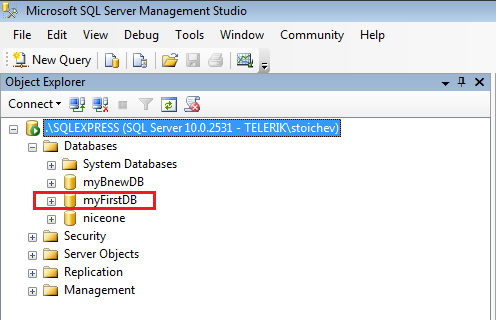
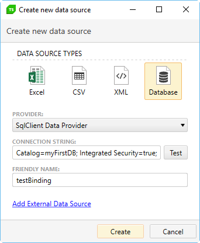

# SQL Database Example

Let's say we have a SQL Server with the name of **SQLEXPRESS**. We have to create a database in this server in order to use it for data binding. One way to do it is by using <a href="https://docs.microsoft.com/en-us/sql/ssms/download-sql-server-management-studio-ssms" target="_blank">SQL Management Studio</a>.

Let's create a database called **myFirstDB**:



Now we can connect to it and use it for data-driven testing.

1. Load the **Create New DataSource** menu.

    

2. Choose **Database**.

3. For **Provider**, select **SqlClient Data Provider**.

4. Here's an example for **Connection String**:

    ````
    Data Source=MACHINENAME\SQLEXPRESS; Initial Catalog=myFirstDB; Integrated Security=true;
    ````

    - Data Source is the name of the SQL Server.
    - Initial Catalog is the named of the Database.

    It is possible to use different connection strings. See <a href="https://www.connectionstrings.com/sql-server/" target="_blank">here</a> for more examples.

5. Customize the **Friendly Name** as desired.

6. Click on **Create** button and the new data source should appear in the Data Sources list.

