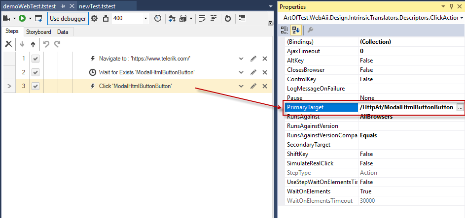
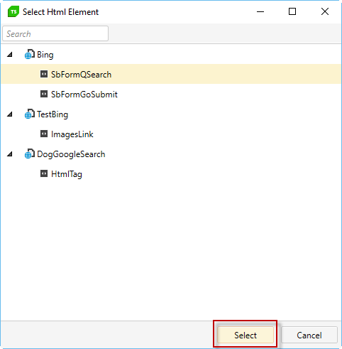

# Change Step Target Element

If a test step targets an incorrect element, or if you <a href="/features/recorder/highlighting-elements">add a new element to the Elements Repository</a> and wish for a step to target this new element, you can change the target element of a test step.

To choose a different target element for a specific test step from the Elements Repository:

1. Select a step from the **Test Steps Panel**.

2. In the Test Step **Properties** pane, click the **Primary Target** property.

3. Click the '...' button.

    

4. In the **Project Elements Selector,** click the new target element for the test step.

5. Click **Select**.

    

