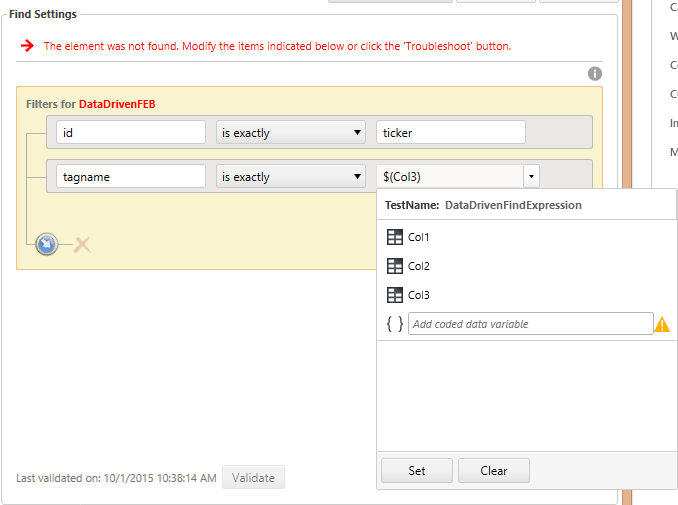
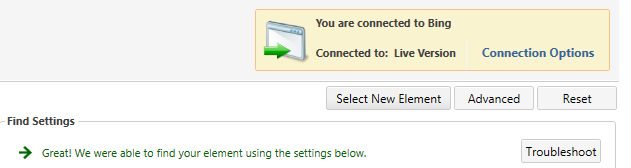
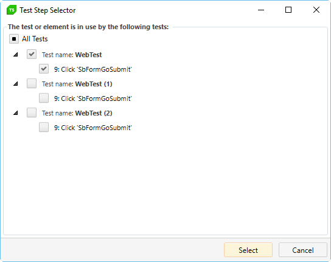

# Data-driven find logic

Here, you can also <a href="/features/data-driven-testing/overview" target="_blank">data drive</a> the element find expression. If your test has an attached data source, the value fields of the find expressions for your elements will include a drop-down list displaying columns from your data source.

Selecting a column binds the data value to the find expression rule.

If the element was not found, click the **Troubleshoot** button. Choose a suggested fix from the Troubleshoot screen.

There are three additional buttons in the upper right of the **Find Element** dialog:

- **Select New Element** - choose this option if the incorrect element was selected for this step. This will clear your current settings and <a href="http://www.telerik.com/teststudio" target="_blank">Test Studio</a> provides new filters for the new element. 

- **Advanced** - edit the Find Settings using a string-based expression builder. 

- **Reset** - restores fields to their original settings. 

Once you've confirmed you are targeting the correct element and it is correctly found, click Save and Close. If the modified element is used by multiple automation steps, you are prompted to select the steps you want to persist changes to.

