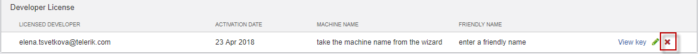

# Re-activating your License #

My machine was freshly imaged or replaced and I need to re-activate my license on the new machine. When I try to re-activate my new machine I have 0 seats available. To be able to generate new license key corresponding to the fresh machine follow the below steps:

1.Log on to your <a href="http://www.telerik.com" target="_blank">Telerik.com</a> account.

2.Navigate to __Test Studio__ product.

3.<a href="https://www.telerik.com/account/your-products/testing-tools-manage-license-keys" target="_blank">Manage Test Studio Activation Keys</a>.

4.Find and delete your old key. This will free up a slot allowing to activate your new machine.

