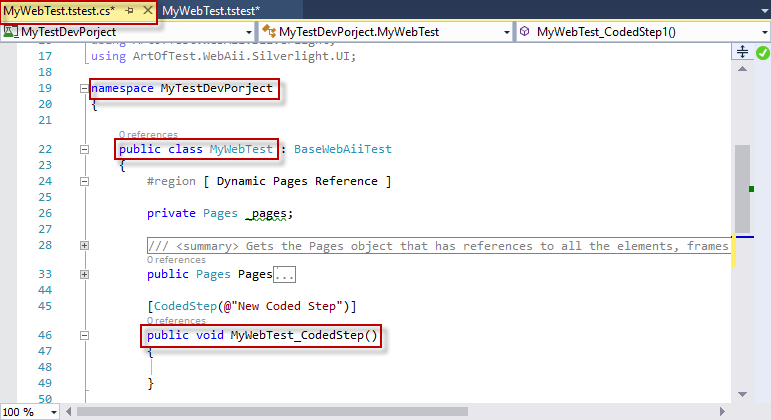
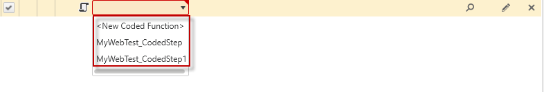

# Features in Code

__Test Studio Dev__ allows you to implement coded solutions for a scenario that requires more complexity than what can be composed with recording your actions and building advanced steps with the Step Builder. There are few ways you could proceed implementing custom code in a Test Studio Dev test and these are described below. 

## Coded Step

__Test Studio Dev__ supports coded steps. This allows you to write code and have it executed as a test step. Use a coded step for a scenario where you need to extend the recorded steps functionality.

1.&nbsp; Add a coded step from the <a href="/features/recorder/step-builder" target="_blank">Step Builder</a> under the _Common_ section.

![Add a coded step][1]

Inserting the first __Coded step__ in a test automatically generates a <a href="/code-in-test/features-in-code#Code-Behind-File" target=blank>code behind file</a> for the current test and opens it ready for editing.

Each next coded step allows you to choose whether to reuse any of the existing methods in the class or create a new one. Each existing and valid method in the code behind could be assigned to a coded step in the test.

> __Note!__ To actually execute the implemented code you have to bind the test method to an existing coded step in the test.
> A single method can be called from multiple steps in the test.

## Convert Step in Code

Almost each recorded step could be edited in code from the <a href="/features/test-maintenance/test-step-context-menu" target="_blank">Step Context menu</a>. The steps which could not be converted because of their specifics are dialog handling steps, all condition steps (if...else, loop, while) and the Manual step and Inspection Point step in the Common section of the Step Builder.

![Convert step into code][5]

This will generate a code-behind file (if this is the first coded step for the test) or will add a new method to the already existing code-behind file. The method for a recorded step will contain the required actions in code to execute all actions for the step.

## Code Behind File

The code-behind file is automatically generated when a coded step is inserted in a test. A plain code behind file (without inserted methods) can be generated by clicking the _Add Code Behind File_ button. 

![Add Code Behind File][3]

The code-behind file is nested under the parent test in Solution Explorer:

![Code Behind File][4]

A code behind file can be generated for each test where you need to implement coded steps and custom test classes. That coded file and its methods are related to the particular test.

* the __code behind file__ uses the respective test name as its name
* its __namespace__ is the project name
* the __class__ which contains the methods is named with the test name
* __each method__ uses the respective step name (if generated when inserting a coded step or converting a step to code)

## Custom code

You can implement any custom logic organized in standalone code files located in your project. This includes but is not limited to classes and functions which perform common or often re-used functionality and can be called by your coded steps or code behind methods. The only requirement is to define classes in the project namespace else they will not be accessible.

[1]: images/fig1.png
[2]: images/fig2.png
[3]: images/fig3.png
[4]: images/fig4.png
[5]: images/fig5.png