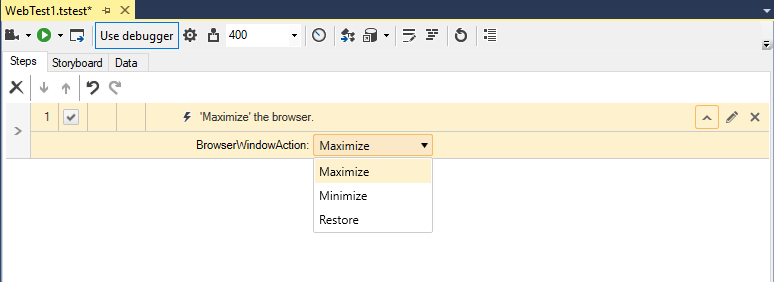
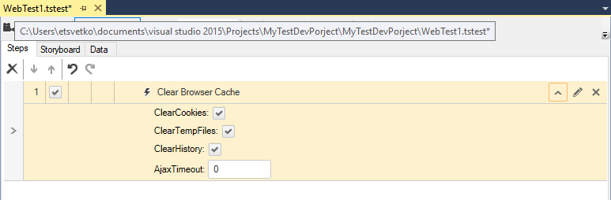
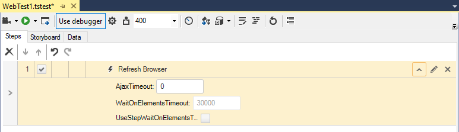
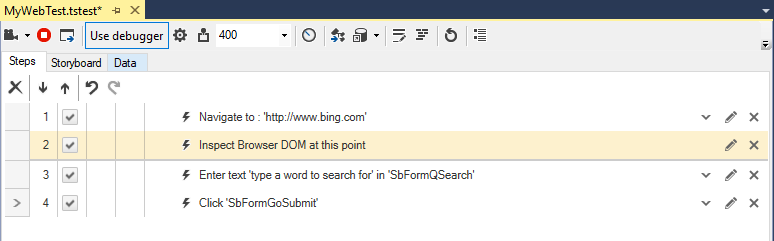
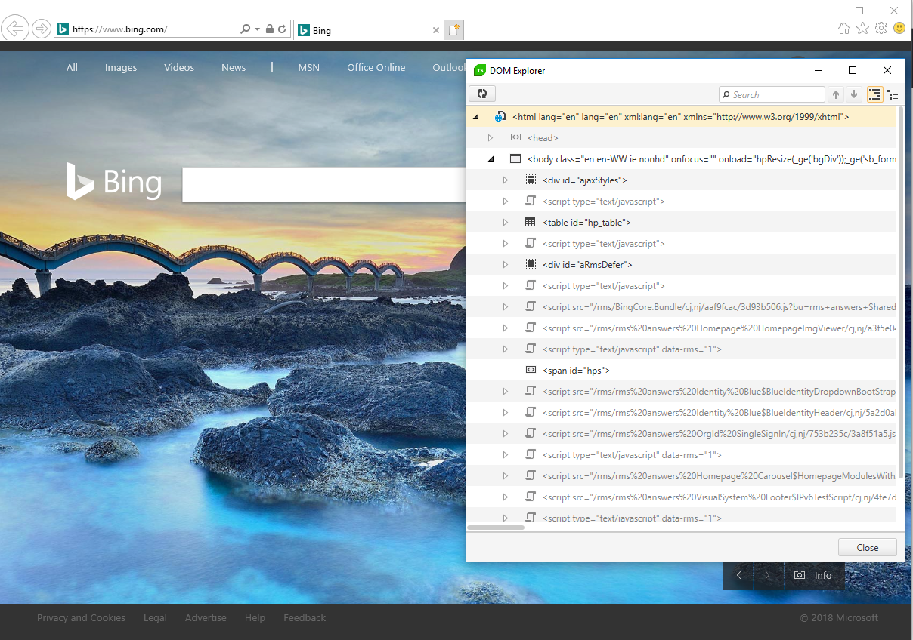

# Custom Steps Related to Browser State

The <a href="/features/recorder/step-builder" target="_blank">Step Builder</a> allows you to add steps which will manipulate the browser. These steps can be found in the _Common_ section of Step Builder.

## Maximize Browser

Inserting a _Maximize Browser_ step will change the browser window state - maximize, minimize or restore - depending on the selected from the dropdown option.

## Clear Browser Cache

Inserting a _Clear Cache_ step will clear __all__ cookies, temp files and/or history from the active browser - depending on the requirements some or all of these could be selected.

This could be useful if you want to start a test against a clean browser without saved information (like username and password), or saved state information (if a user is logged in, last visit date, preferences, etc.).

> __Safari__ doesn't support clearing cache.

## Refresh Browser

Inserting a _Refresh Browser_ step will refresh the active browser.

## Inspection Point

Inserting an _Inspection Point_ step will pause the test and display the DOM Explorer at this point. This is useful while debugging a test to view and inspect the DOM tree at a specific point of the execution - to explore if a specific element remains as you originally recorded it or its <a href="/features/elements-explorer/find-element" target="_blank">Find Expression</a> requires modification.

The test will remain paused until you close the DOM Explorer window.

