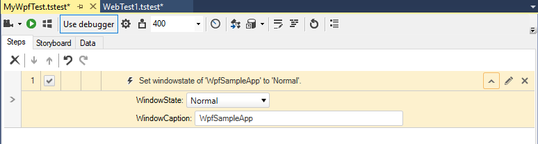

# Change Window State

The <a href="/features/recorder/step-builder" target="_blank">Step Builder</a> allows you to add steps which perform actions which not be recorded. The below described step can be found in the _Common_ section of Step Builder.

The _Change Window State_ step is WPF application specific and is __only applicable for a WPF Test__. Enter the correct WindowCaption to execute the step against the desired window. The WindowState options are:

* Normal
* Minimized
* Maximized
* Closed

