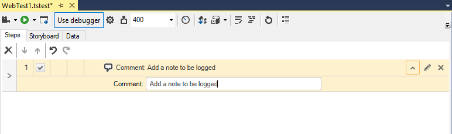

# Comment

The <a href="/features/recorder/step-builder" target="_blank">Step Builder</a> allows you to add steps which perform actions which not be recorded. The below described step can be found in the _Common_ section of Step Builder.

The _Comment_ step allows you to enter a text comment which is represented as a single test step and is shown in the test log. Use this step to make notes throughout your test and provide more information to those reading the test results.

