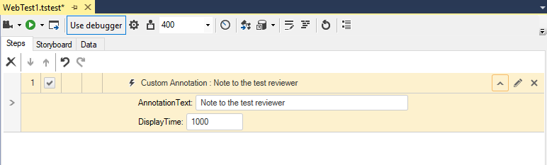
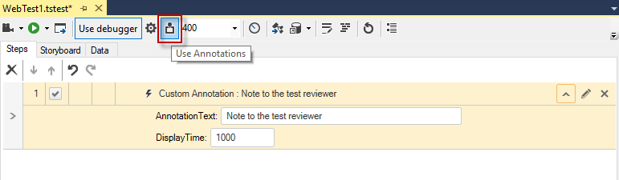

# Custom Annotation

The <a href="/features/recorder/step-builder" target="_blank">Step Builder</a> allows you to add steps which perform actions which not be recorded. The below described step can be found in the _Common_ section of Step Builder.

The _Custom Annotation_ step adds a note displayed in the browser during TS Dev Quick Execution. Use this to communicate with the test reviewer, or if you want to point out some information to the developer - for example "This test step fails intermittently."

Some of the properties available to modify this step:

* **AnnotationText** - the text displayed on the screen.
* **DisplayTime** - the time (in milliseconds) to display the annotation.
* **DisplayLocation** - where on screen (relative to the browser window) the annotation will be displayed.

__Note!__ Be sure to <a href="/features/test-execution/quick-execution#execute-with-annotation" target="_blank">enable annotations</a> during Quick Execution to see the message.

Here's how the note appears during quick execution:

