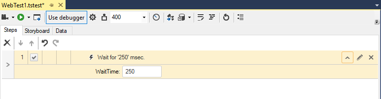

# Execution Delay

The <a href="/features/recorder/step-builder" target="_blank">Step Builder</a> allows you to add steps which perform actions which cannot be recorded. The below described step can be found in the _Common_ section of Step Builder.

Inserting an _Execution Delay_ step will pause the test for a set amount of time. Set the "WaitTime" property of the step to any number in milliseconds. An execution delay can help in observing test execution and identify possible misbehavior. 

__Note!__ If you want the test to pause for a set amount of time after each step during quick execution use the Annotation feature.

__Note!__ Execution delay could be used to control the execution speed of a test in general. Its only disadvantage is it is hard coded. If you require to control the speed of executed steps based on the elements on page use <a href="/features/recorder/step-builder" target="_blank">Verify and/or Wait steps</a>.