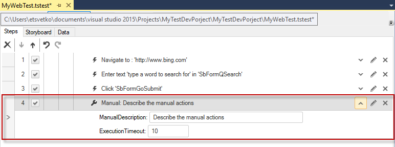
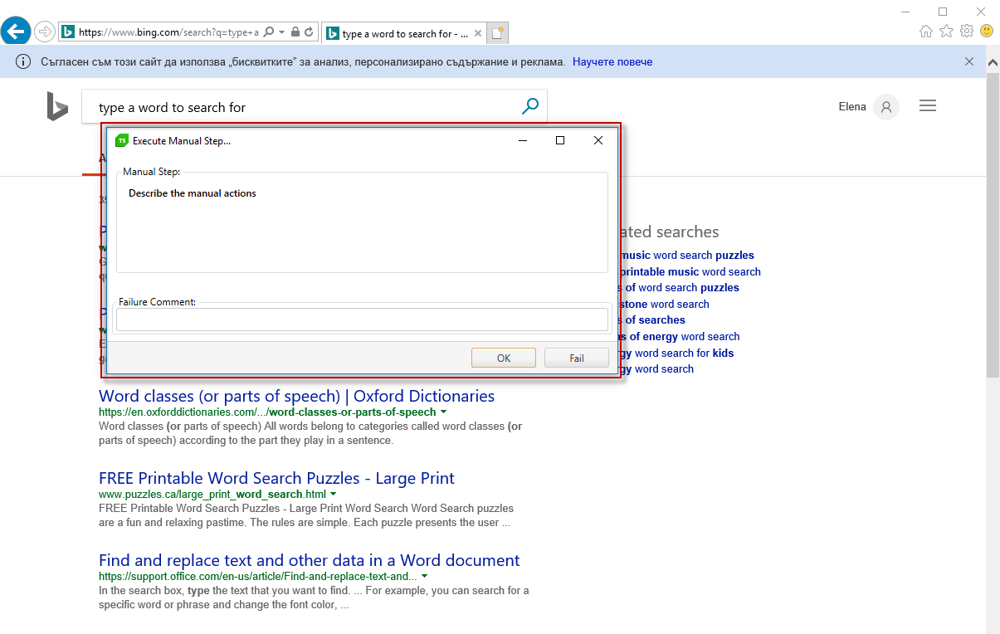

# Manual Step

The <a href="/features/recorder/step-builder" target="_blank">Step Builder</a> allows you to add steps which perform actions which cannot be recorded. The below described step can be found in the _Common_ section of Step Builder.

The _Manual step_ will display directions what manual actions are required at a specific point in test execution. 

An example is if a certain step cannot be automated and you wish you run it manually, simply add a Manual Step to your test. Enter directions for that step and Test Studio will prompt the tester to perform the action, and then choose to pass or fail that step. If fail is chosen, the tester can enter a comment on the reason.

A Manual Step could perfectly fit for automation of sites that use a <a href="http://en.wikipedia.org/wiki/CAPTCHA" target="_blank">CAPTCHA</a> code.  The CAPTCHA images are specifically designed to ensure the response is generated by a person and not a computer and therefore the full automation of these could be hardly accomplished. We recommend using a Manual Step and have the tester type in the code.