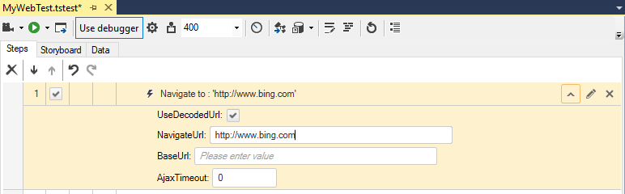

# Navigate To Step

The <a href="/features/recorder/step-builder" target="_blank">Step Builder</a> allows you to add steps which perform actions which cannot be recorded. The below described step can be found in the _Common_ section of Step Builder.

The _Navigate To_ step is usually the first recorded step in a test. You could insert a Navigate To step at any point of the test where this is required. The URL could be divided into BaseURL and NavigateURL depending on the URL's specifics and optionally the <a href="/features/project-settings/recording-options" target="_blank">recording settings</a> you have applied for adding a page node to the element's repository. 

