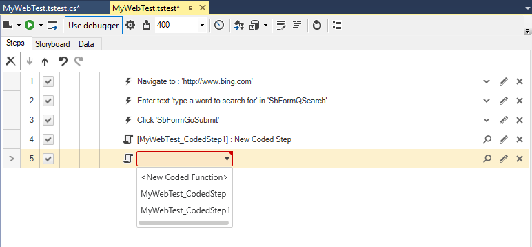

# Coded Step

The <a href="/features/recorder/step-builder" target="_blank">Step Builder</a> allows you to add steps which perform actions which cannot be recorded. The below described step can be found in the _Common_ section of Step Builder.

Inserting the first <a href="/code-in-test/features-in-code" target="_blank">__Coded step__</a> in a test automatically generates a code behind file for the current test and opens it ready for editing.

* the __code file__ uses the respective test name
* its __namespace__ is the project name
* the __class__ which contains the methods is named with the test name
* __each method__ uses the respective step name

Each next coded step allows you to choose whether to reuse any of the existing methods in the class or create a new one.

## See Also

<a href="/code-in-test/features-in-code#Coded-Step" target="_blank">How to use coded step</a>