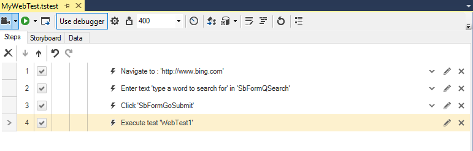
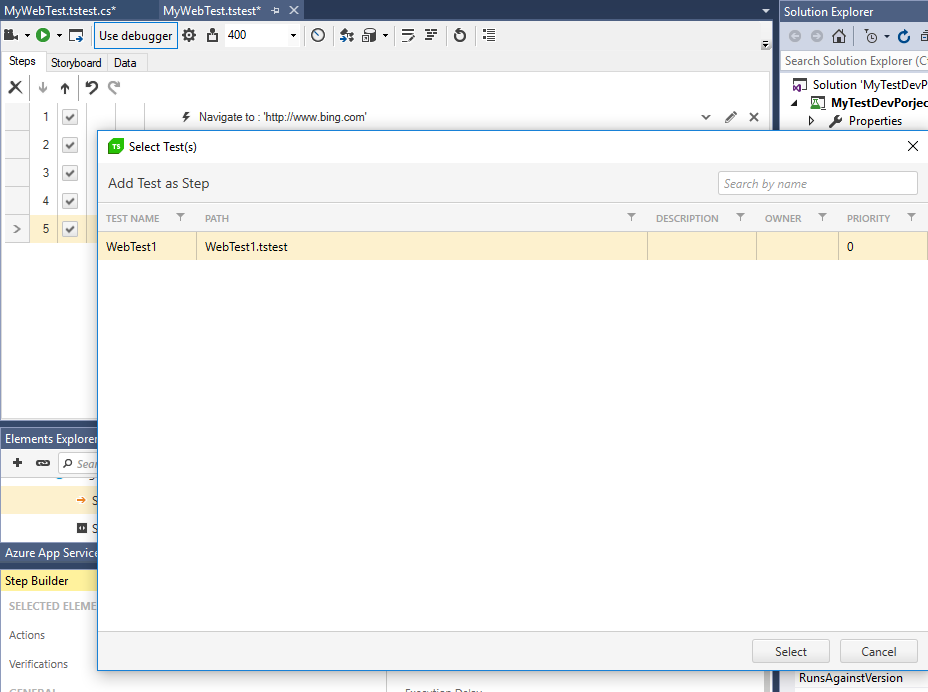

# Test as Step

The <a href="/features/recorder/step-builder" target="_blank">Step Builder</a> allows you to add steps which perform actions which cannot be recorded. The below described step can be found in the _Common_ section of Step Builder.

Inserting a _Test as Step_ allows you to run an existing test as a single step within another test.

This feature can help reuse common automated test steps in the project. This is also known as test modularization. The approach includes breaking up your testing tasks into modules that do specific small functions on their own, but do not perform the complete end-to-end testing scenario - these could be Login, Logout, etc.

When inserting a test as step you are allowed to choose between all tests of the same type in the project. 

