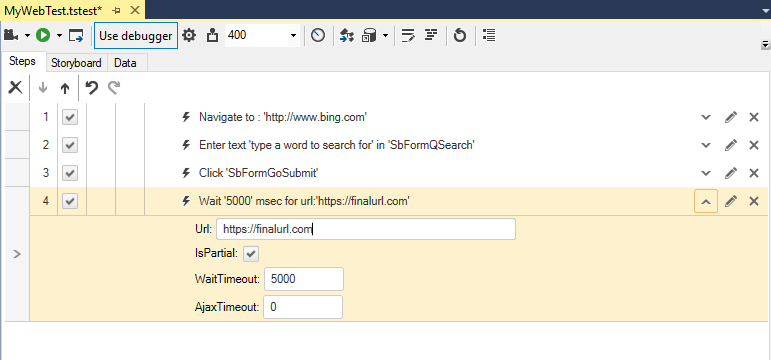

# Wait For URL

The <a href="/features/recorder/step-builder" target="_blank">Step Builder</a> allows you to add steps which perform actions which cannot be recorded. The below described step can be found in the _Common_ section of Step Builder.

The _Wait For URL_ step will suspend the test until the specified URL is loaded into the browser address bar. Wait For URL is particularly useful when you have a redirection and need to wait for the final URL to be loaded.

