# Add an External Data Source To Your Test Project

> When adding an external data file to your project, a copy of that file is placed in the _Data_ folder under the project's root folder. This is from where the file is accessed and any changes should be made to the file in this location.

## Add an Excel Spreadsheet

The first row entries in the Excel spreadsheet are used as column names when attaching columns to the inputs. In this example, *Input A* is the name of the first column, *Input B* is the name of the second column, and *Results* is the name of the third column and these will be used to identify the columns to attach to the input values of the test steps.

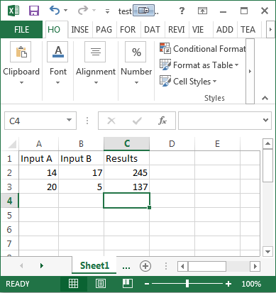

> _Note!__ For numeric-only fields, you may need to add an apostrophe, also known as a single quote character ( ' ), to the beginning of the number for the data to render correctly in Test Studio. This is an Excel command to store the number as text.

Open the data source dropdown by clicking its button down arrow, then select **Add New > Excel**.

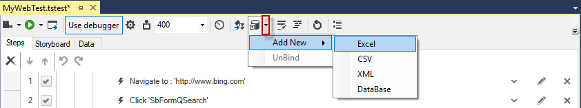

The **Create new data source** dialog opens:

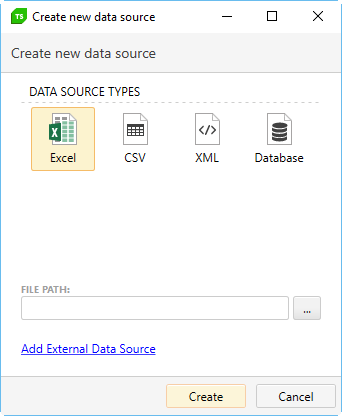

Enter the path to your Excel file or click the "..." button to browse and select it. Click _Create_ to save this data source definition. A new entry is added to the Data folder of your test project.

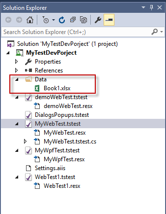

Click Ok to confirm binding the current test to the Excel data file.

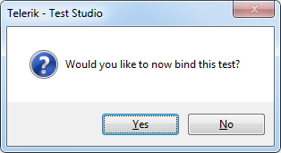

Then select data source and data table in the _Bind test to data source_ dialog to see the Excel sheet data bound to the test. 

<table id="no-table">
<tr>
<td>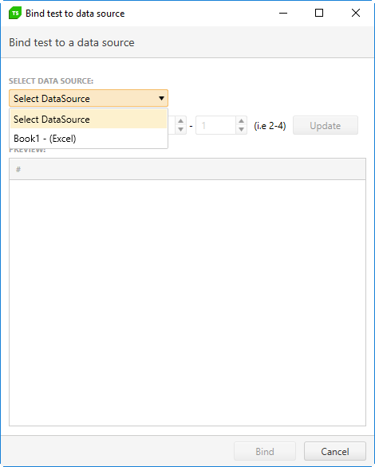</td>
<td>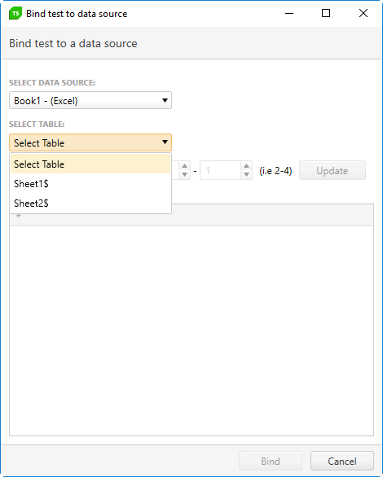</td>
<td>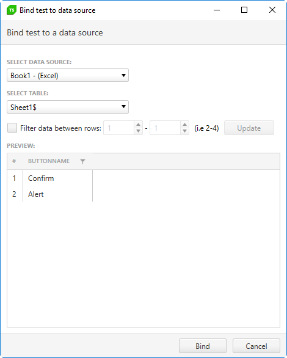</td>
</tr>
<table>

## Add an XML File

Here is an example of a basic XML file with two columns:

````XML
<Searches>
   <Search UserName="john.smith" Password="t3ler1k" />
   <Search UserName="bob.brown" Password="5ilverl1ght" />
   <Search UserName="sam.jones" Password="t3st5tudi0" />
</Searches>
````

*Search* is the equivalent of an Excel Sheet. *UserName* and *Password* translate as the column names. Use **$(UserName)** and **$(Password)** to data bind the applicable properties.

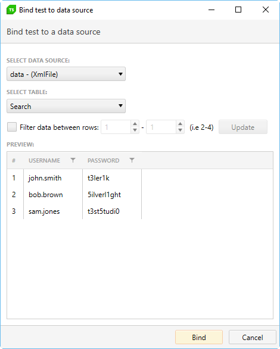

## Add a CSV File

CSV files can be created in any spreadsheet application or directly in Notepad if you follow the *.csv formatting conventions (each line with comma separated values, the same number of commas in each line).

Here is an example of a basic CSV file with two columns:

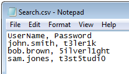

Just like an Excel spreadsheet, the first row of data will be used as the column names. Use **$(UserName)** and **$(Password)** to data bind the applicable properties.

## Add a Database Source

Adding a database source is different than adding an Excel spreadsheet, CSV, or XML file. When you select Database in the Create new data source dialog, you have a number of new options you need to specify in order to define your database connection.

- **Provider** - in this drop-down, select which database provider to use to access your database. The list that is displayed here depends on which providers have been installed on your computer. You should contact your database administrator if you are not sure what to select.
- **Connection String** - enter a valid connection string that is supplied to the selected Provider. The connection string instructs the provider the details on how to connect to your database.
- **Test** - click this button to test the connection to your database. A dialog indicating success will display if <a href="http://www.telerik.com/teststudio" target="_blank">Test Studio</a> makes a connection.
- **Friendly Name** - enter a name to represent this database connection definition. The name entered here is displayed in the Data Sources pane in the Standalone version and in the Data folder in the VS plugin.

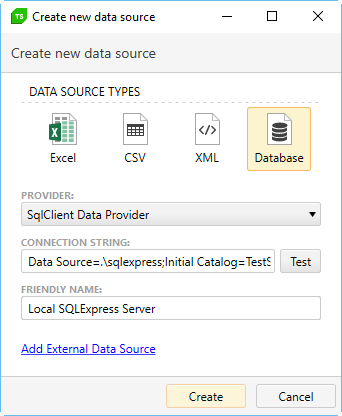

Once you have added the data source you could proceed to <a href="/features/data-driven-testing/bind-test-data-source" target="_blank">__bind a test to that data source__</a>. 

__See Also:__

* <a href="/advanced-topics/data-driven-testing/sql-database-example" target="_blank">How to connect a SQL Database to be used for data source</a>
*  <a href="/advanced-topics/data-driven-testing/oracle-db-example" target="_blank">How to connect an Oracle Database to be used for data source</a>

