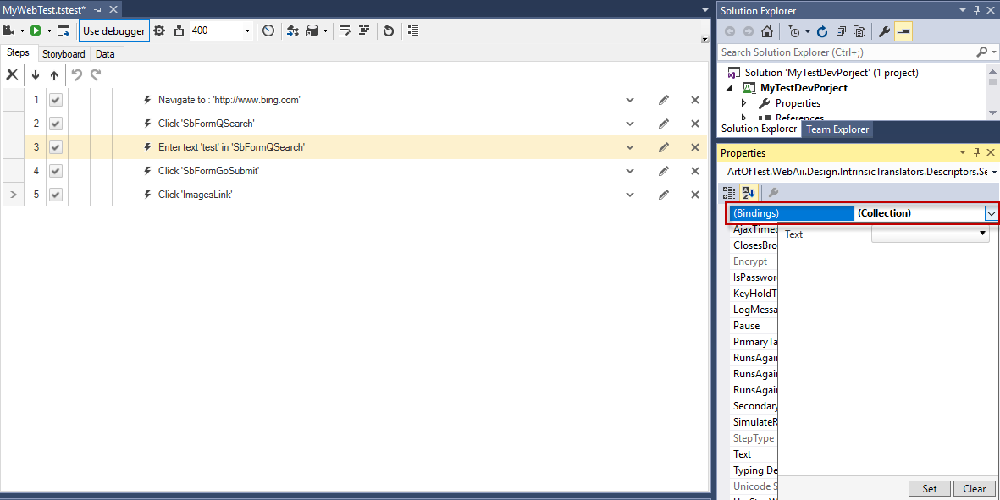
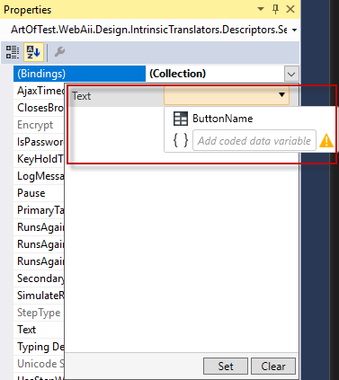
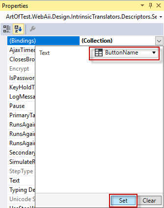
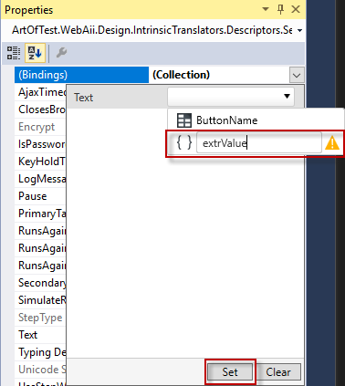

# Attach Columns to Input Values

Most action steps have at least one property that can be bound to a column from your data source. To bind a test step property to a project data source column follow the steps below:

1. Click the step in the Test Steps pane to activate its properties in the Property pane.

2. Click the _(Collection)_ dropdown next to the _(Bindings)_ property to see the available properties for the selected step which could be data driven. 

    

3. Click the dropdown menu next to the step property which will be data driven to see the available columns from the data source.

    

4. Select the column name which contains the respective values for that property and click the **Set** button. 

>__Note!__ If the current test is used as a <a href="/features/custom-steps/test-as-step" target=blank>test as step and inherits the parent data source or there is a variable value extracted in code the list described above will __not__ contain these.

If you wish to access the data source of a parent test or the extracted variable, type the column or variable name in the text box (without the $ notation), click the brackets and **Set** button. 

Review how to attach a column to <a href="/features/data-driven-test/attach-columns-verifications" target=blank>Verification step</a>. 

