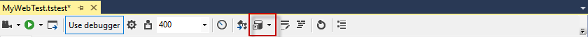
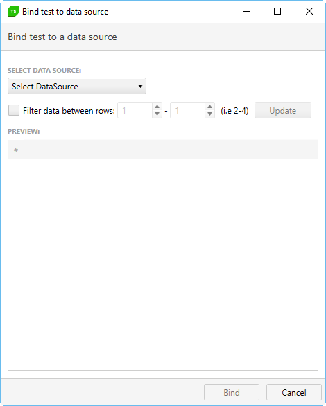
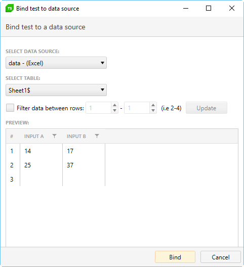
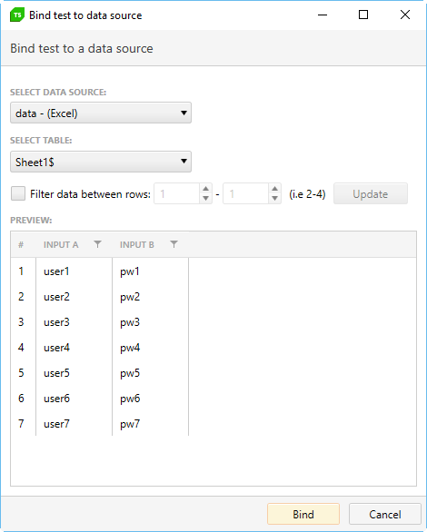
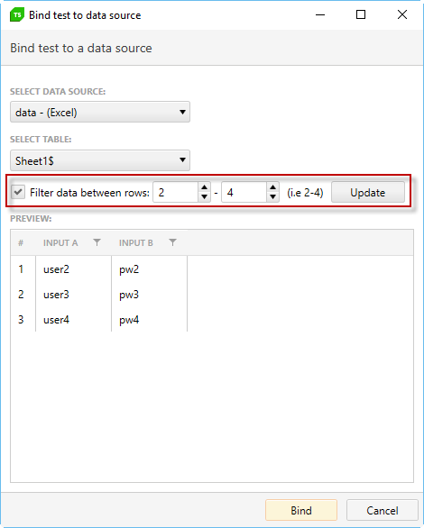
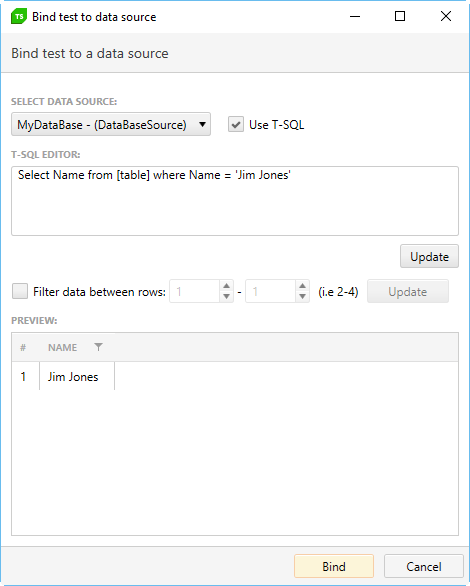
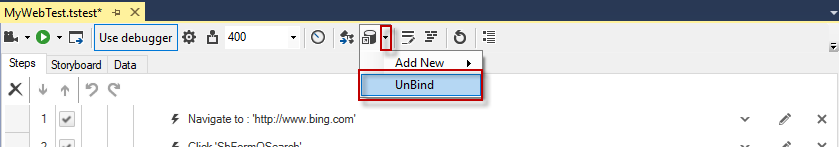

# Bind Test to a Data Source

Now that you have added a data source definition to your test project, you are ready to bind your test to that data source. Click the _Bind test to data source_ button. 

The **Bind test to data source** dialog opens:

Click the **Select DataSource** dropdown and choose the data source you just defined in the previous section. If your source is an Excel spreadsheet, choose which sheet from the spreadsheet to use. Once you select a sheet, the data from that sheet will be read and displayed in the dialog. Note that the first row of the excel spreadsheet is used to define the column names.

Check the **Filter data between rows** box under the **Configure** section to adjust which rows from the data source to use:

- If left unchecked, all data rows will be used during the test run.
- To define which rows to use, check that box and select which rows you want to use by clicking the numeric up/down counters, and then **Update** to apply changes.

<table id="no-table">
<tr>
<td></td>
<td></td>
</tr>
<table>

> To be able to bind an Excel file you must have Microsoft Office installation on this machine or <a href="https://www.microsoft.com/en-us/download/details.aspx?id=23734" target="_blank">Microsoft Data Connectivity Components</a> (x86 redistributable).

If your source is a __SQL database__, you have the option of using T-SQL to select the data you want. Using T-SQL, you can get as complex as you need in your SQL select statement. For example:

After entering your select statement, click **Update** to test and display the selected data in the **Preview** table.

Click OK to bind this data source to your test.

## Remove Data Binding

To remove the external data source associated with a test, open the test and click the down arrow of the _Bind test to data source_ button and click on __Unbind__.

After you have configured the test to use a data source you can attach the data columns to <a href="/features/data-driven-testing/attach-columns-input-values" target="_blank">__an input value__</a> or <a href="/features/data-driven-testing/attach-columns-verifications" target="_blank">__a verification__</a>. 

