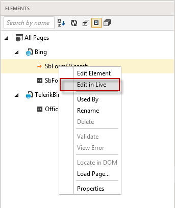
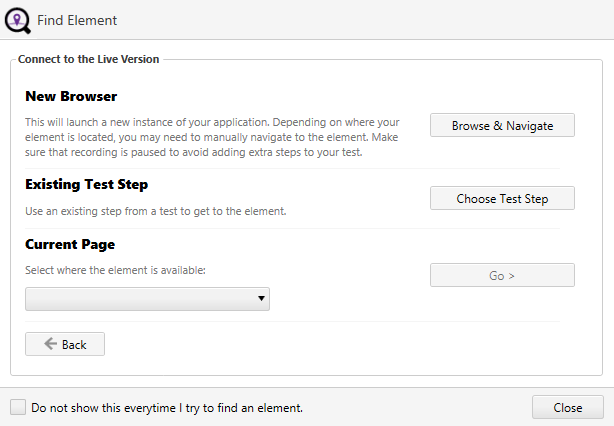
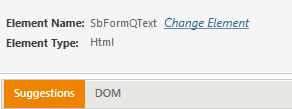
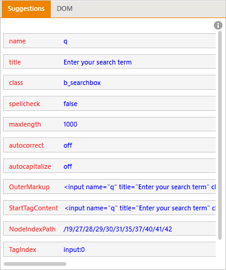
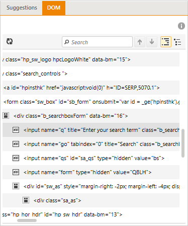
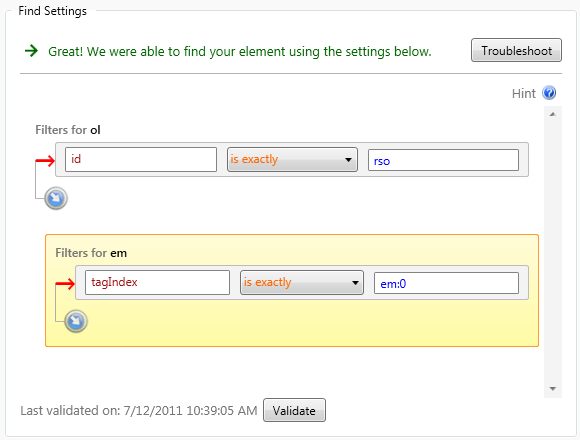
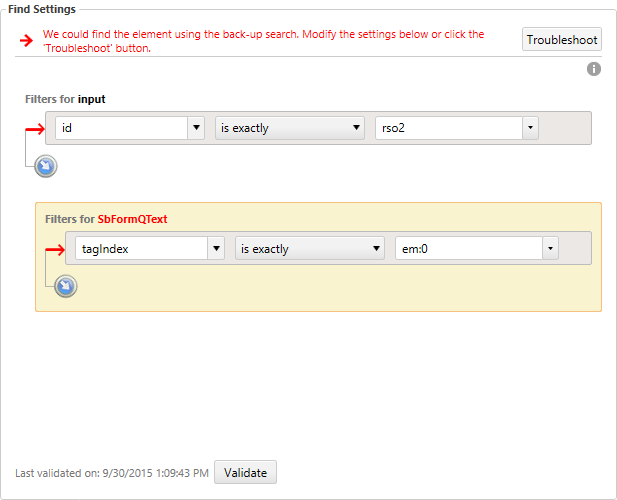

# Change How an Element Is Found

When an action is recorded against an element from a web page or WPF application, Test Studio Dev generates a **Find Expression**, which is then used to locate that element in the application during execution. The same process is triggered if an element is explicitly added to the Elements repository from the DOM explorer. As of Test Studio Dev release 2019 R2 (v.2019.2.619) the elements' find expression is enhanced with an image and thus, each newly recorded element gets an image along with its automatically generated find expression. The image will be used as a backup search criteria in case the element's find clauses didn't match any element on the page.

> **Note:** The recording of images in a Test Studio Dev project is enabled by default. The recorded images cannot be modified or changed. You can only <a href="/features/project-settings/element-images" target="_blank">disable the usage of images</a> during execution of the tests from certain project.

In some occasions the automatically generated find expression may not be suitable and may require to be modified. To change how an element is found, right click on the element in the Elements explorer __add a link__ and select either **Edit Element** or __Edit in Live__.

Select **Edit in Live** to directly open the <a href="#find-element">Find element</a> dialog for the page currently loaded with an attached recorder to it. If there is no active recording session this option will be greyed out.

The **Find Element** splash screen appears. You have three options for how to locate the element:

**Find in the Live Version** - this option leads to the next screen where you could choose whether to find the element using a new browser window, an existing test step, or an application that you currently have open (for web testing this is applicable only against IE). 

- **New Browser** - this will launch a new instance of your application. You may need to manually navigate to the element. Click **Browse & Navigate** to proceed.
- **Existing Test Step** - use an existing step from a test to get to the element. Click **Choose Test Step** to proceed.
- **Current Page** - select where the element is available from a list of currently running browser instances (IE only) or WPF applications. Click **Go** to proceed.

**Find in the Cached Version** - if your test failed, you can find the element using the cached version of the application at the time of failure. Accessible only through the **Resolve Failure** tab in the Step Failure Details __add a link__.

**Find Without Connection** - choose this option to find the element without connecting to the application.

> To skip this splash screen the next time you load the Find Element dialog, check the box at the bottom and click Close.

The <a name="find-element">Find Element</a> dialog appears. At its top you can see The Element Name, Element Type, and Connection Status.

The **Change Element** link opens the **Select New Element dialog**.

In the Select Html Element dialog, you can open the Find Element dialog for a different element in the Elements Repository.

The **Connection Options** button takes you back to the **Find Element** splash screen.

**The Suggestions and DOM** views are on the left side.

- **Suggestions** - these are the suggested items to help you find the element in the application. Click an item to add it to your **Find Settings**. 

- **DOM** - use the DOM as a reference when creating your Find Settings. This view is helpful in determining where your element is located relative to the DOM tree. 

The **Find Settings** view is on the right side. You can edit these settings by typing in new properties, selecting a new modifier in the dropdown menu, or changing the values. Click Validate to confirm whether the element can be found using the current Find Settings.

<table id="no-table">
<tr>
<td></td>
<td></td>
</tr>
<table>