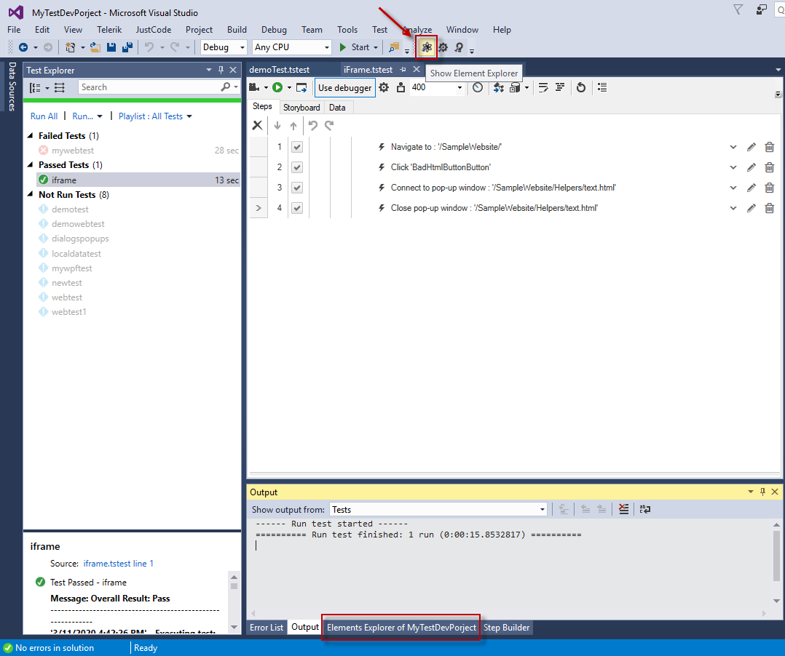
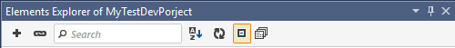
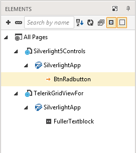
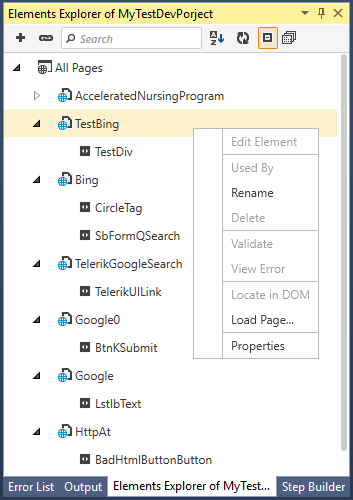
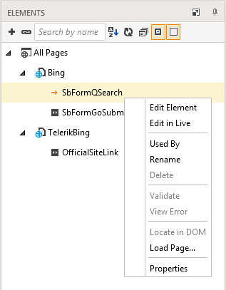

# Elements Explorer

The Elements Explorer displays a tree of elements which you have recorded step against, or manually added to the Element's repository through the DOM explorer in the <a href="/features/recorder/recording-toolbar" target="_blank">recording toolbar</a>. The elements are arranged in a tree view and expose properties more specific to testing. 

Each element is shown only once in the Elements Explorer although it may be used in several tests and test steps. __Test Studio Dev__ relies on an intelligent element identification scheme called <a href="/features/project-settings/find-logic" target="_blank">Find Logic</a> and thus reuses already recorded elements which could be identified with the same find expression.

To open the Elements Explorer in project click on the _Show Elements Explorer_ button. It will appear in the lower middle pane next to _Error List_ and _Output_ tabs.

## Sort Elements in Elements Explorer

The Elements pane maintains a list of all Elements within the current project. It allows you to view elements and edit the way they are found during execution.

The Elements menu bar  has the following buttons:

- **Add Element** - add a <a href="/features/elements-explorer/predefined-elements" target="_blank">Predefined element</a>.
- **Element Mapping (IntelliMap)** - <a href="/features/elements-explorer/element-mapping" target="_blank">Map</a> a Predefined element.

Both of the above options concern a pre-development stage of testing when the application under test is still in rough development.

- **Search** - search the Explorer based on the element's Friendly Name property - the name listed in the elements tree view.
- **Sort** - organize the elements in an ascending or descending order, or clear the sorting.
- **Refresh** - refresh the display of elements in the Explorer. This should be rarely necessary as Test Studio Dev normally refreshes the elements window properly.
- **Expand/Collapse** - show or hide all elements under their respective page nodes.
- **This Test/All Tests** - show elements for the currently displayed test only, or the elements for every test in the project.

The hierarchy is maintained according to where the element is located on the page. For example, if there are no frames or regions, then elements for that particular page will be listed under the Page node.

- The HTML tree view is organized by **Page > Frame > Test Regions > Element**.
- The Silverlight tree view is organized by **Page > Frame > SilverlightApp > Element**.
- The WPF tree view is organized by **Application > Window > Element**.

<table id="no-table">
<tr>
<td> **HTML Tree View**</td>
<td> **Silverlight Tree View**</td>
<td>  **WPF Tree View**</td>
</tr>
<table>

## Maintain Elements in Elements Explorer

Right click a __Page node__ to see a context menu. The active options for it are listed below:

- **Validate** - _active in record mode only_. Validate all elements recorded in the page node against the currently loaded page with attached recorder to it. Results indicated with green checks and red X's. 
- **Rename** - alters the Friendly Name.
- **Load Page** - loads the URL which the page belongs to and attaches the recorder to the browser.
- **Properties** - makes the Properties pane active. 

Each __Element node__ could be maintained with the following options from the context menu:

- **Edit Element** - loads the Find Element menu to choose how to locate this element in your web page or application.This option concerns maintaining elements and <a href="/features/elements-explorer/find-element" target="_blank">their find expressions</a>.

- **Used By** - loads the Test Step Selector and displays all tests and their steps that perform an action against this element.
- **Validate** -  _active in record mode only_. Validate all elements in the page node against the currently loaded page with recorder attached to it. Results indicated with green checks and red X's.
- **Rename** - alters the element's Friendly Name (an easy way to identify the node). This name will also be used for code generation as a variable name or a collection indexer.
- **Delete** - remove the element from the Explorer. The element must be linked to no steps.
- **View Error** - show the erroneous find logic for an element that cannot be found.
- **Locate in DOM** - jump to this element's position in the DOM when the page is loaded and a recorder is attached to it.
- **Load Page** - loads the URL which the element belongs to and attached a recorder to the browser.
- **Properties** - makes the Properties pane active.