# If...Else

Walk-through the IF...Else conditional statement process - <a href="/features/logical-steps/if-else#Build-a-new-IfElse-Statement">how to build a meaningful if...else statement</a>, <a href="/features/logical-steps/if-else#Execution-status-and-Results">what the execution status looks like</a> and a sample on <a href="/features/logical-steps/if-else#Check-if-an-element-exists-in-the-DOM">how to check if an element exists in the DOM</a>.

## Build a new If...Else Statement

1. Create a Web Test and click Record.

2. Navigate to <a href="https://www.random.org/" target="_blank">www.random.org</a>.

3. Set the Min field to 1 and the Max field to 2.

4. Click **Generate**.

    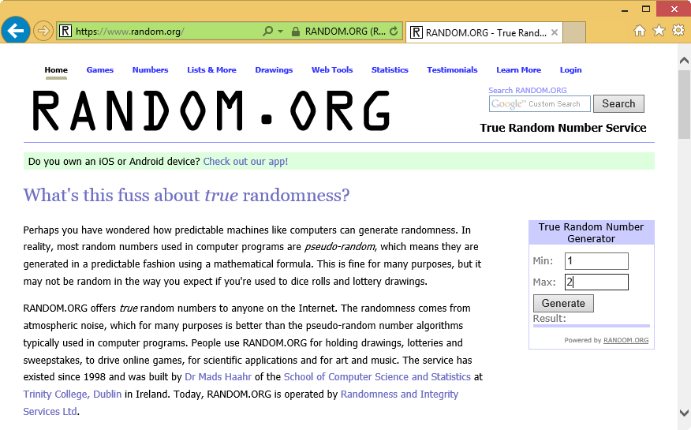

5. Enable hover over highlighting by clicking Highlight Element in the Test Studio Recorder and hover over the *Result box*.

    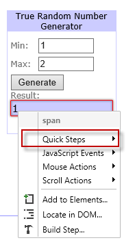

6. Click **Quick Tasks** and double click **Verify - text contains '1'**.

    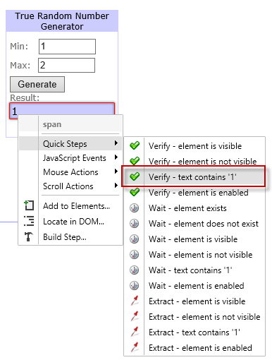

7. Disable hover over highlighting and minimize the browser.

8. Choose **Conditions** in the <a href="/features/recorder/step-builder">**Step Builder**</a> and add **if...else** step.

    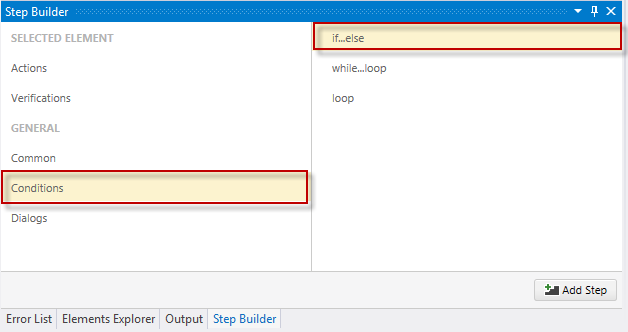

9. From the drop down in the IF step select the previously recorded verification.

    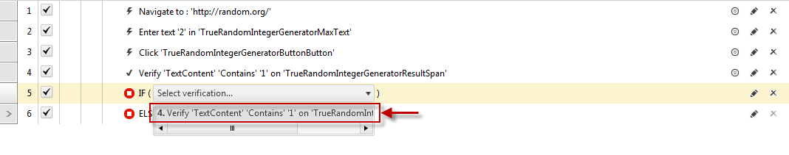

10. Uncheck/Delete the verification outside the IF step, so it will not be executed (We have this verification already added in the IF step)

    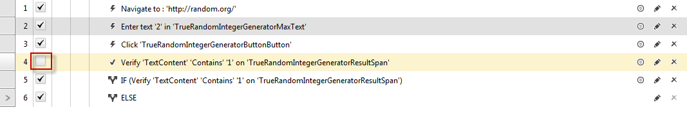

11. Bring up the IE recording window and navigate to <a href="http://www.google.com" target="_blank">www.google.com</a>. Minimize the browser again.

12. Drag the *Navigate to Google* step into the IF step.

    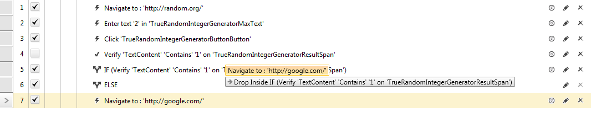

13. Bring up the IE recording window and navigate to <a href="http://www.bing.com" target="_blank">www.bing.com</a>. Minimize the browser again.

14. Drag the *Navigate to Bing* step into the ELSE step.

    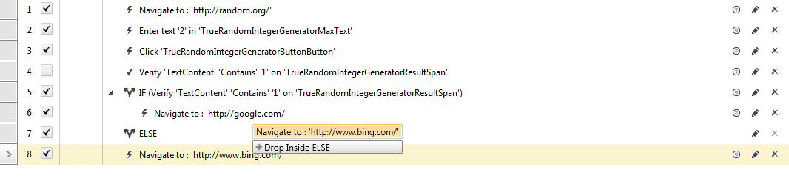

## Execution status and Results

15. Save and Execute the test.

- If 1 is generated the **if condition** is evaluated as true and the steps in the **if branch** are executed. The steps in the **else branch** are skipped and shown as 'Not Run'.

    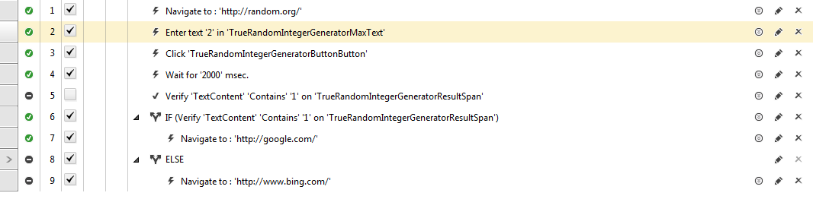

- If 2 is generated the **if condition** is evaluated as false (for example, the target TextBox element contains the wrong content) and the steps in the **else branch** are executed. The skipped steps are in the **if branch** and are shown as 'Not Run'. 
- **Note**:  if the condition of an **if branch** cannot be evaluated (for example, the target element for a TextContent verification cannot be located), the steps in the **if branch** will be skipped again, and will display a 'not-run' icon as if the condition is false. 

    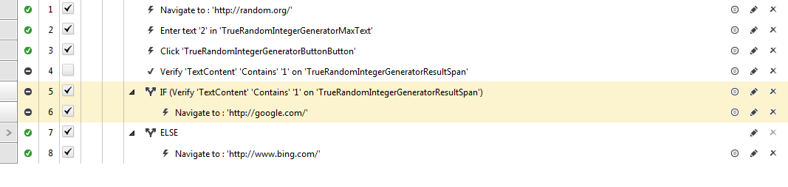

## Check if an element exists in the DOM

To check if an element is present in the application DOM - a "<a href="/features/recorder/verifications/Wait" target="_blank">wait on element</a>" verification has to be used. It returns *true/false* output and **if condition** could be completed not braking the test execution. On the following image - if step 4 does not execute - the *SecondLink* element would not be added to the DOM and steps would continue in the **else branch**.

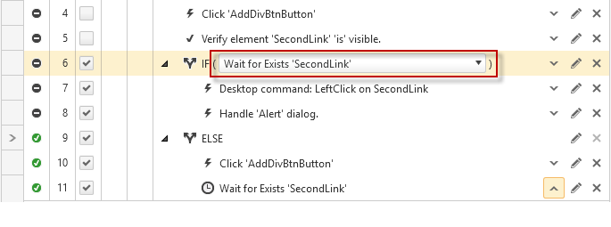

If step 4 is executed the *SecondLink* element would be added to the DOM and **if condition** passes normally as shown bellow.

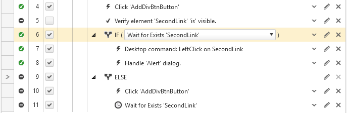

