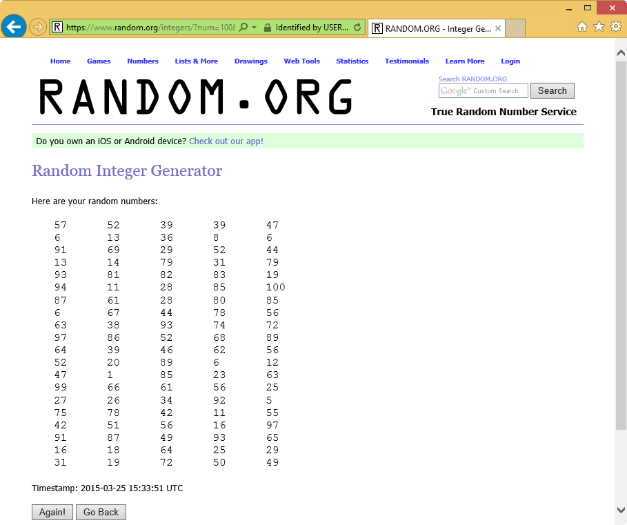
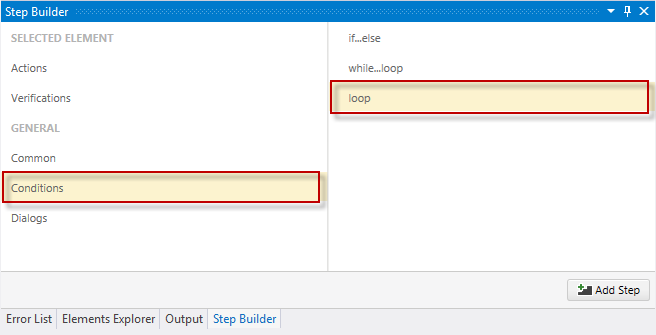
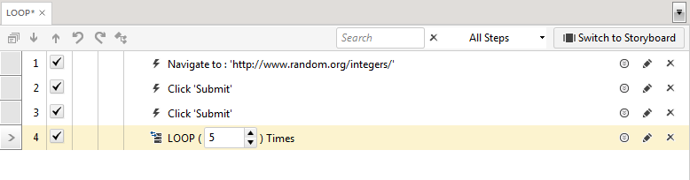
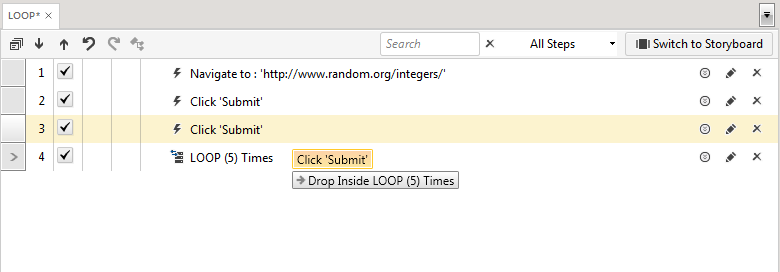

# Loop

Walk--through of creating a loop process.

1. Create a Web Test and click **Record**.

2. Navigate to <a href="http://www.random.org/integers/" target="_blank">www.random.org/integers</a>.

3. Click Get Numbers. 

4. Click Again.

    

5. Pause recording and minimize the browser.

6. Choose **Conditions** in the <a href="/features/recorder/step-builder">**Step Builder**</a> and add **loop** step.

    

7. Set the *Count* of the Loop step to 5.

    

8. Drag the second Click Submit step into the *LOOP* step.

    

9. Save and Execute. After the initial set of integers is generated, the process is repeated 5 times.

