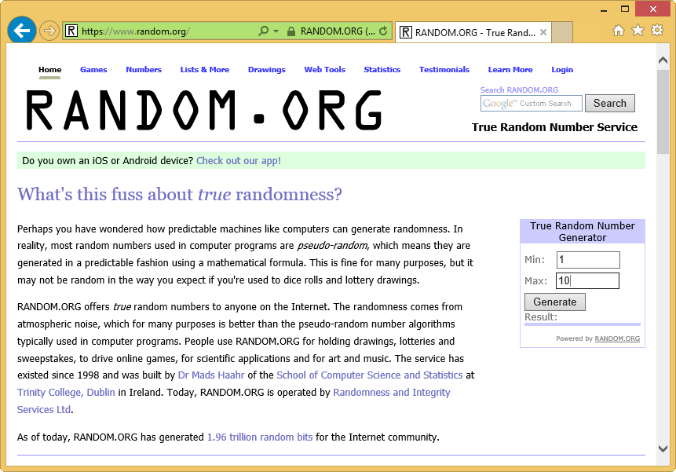
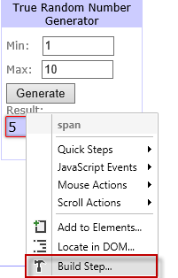
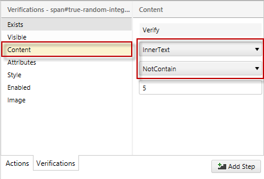
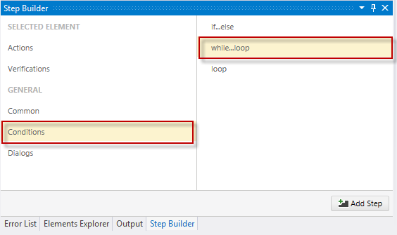
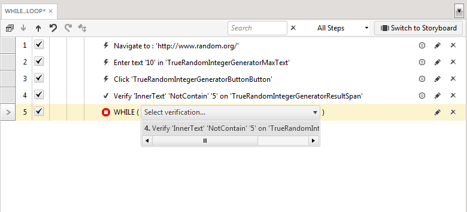
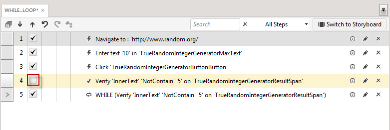
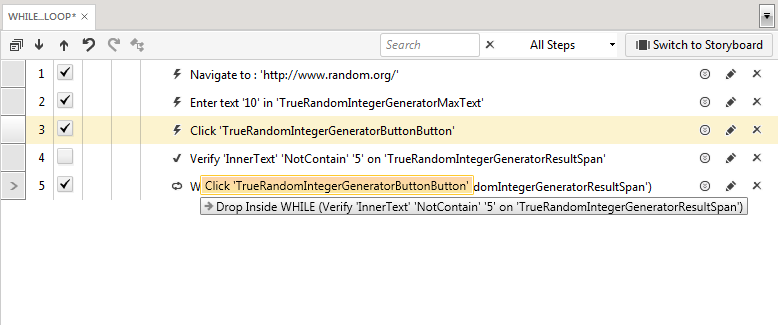
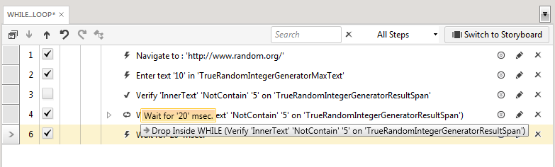
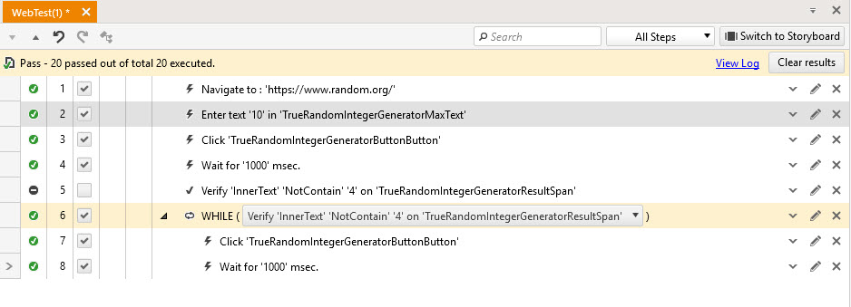
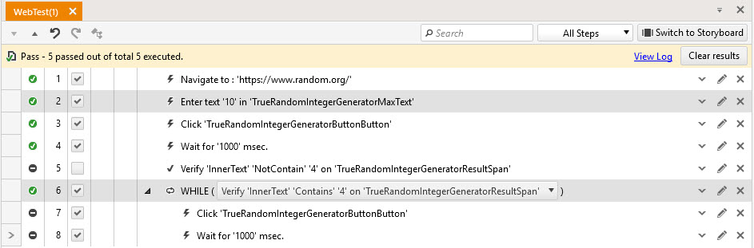

# While...Loop

Walk--through of <a href="/features/logical-steps/while-loop#Build-a-While-loop">Do...While Statement process</a> and <a href="/features/logical-steps/while-loop#Execution-Status">execution status overview</a>.

## Build a While loop

1.&nbsp; Create a Web Test and click Record.

2.&nbsp; Navigate to www.random.org.

3.&nbsp; Set the Min field to 1 and the Max field to 10.

4.&nbsp; Click Generate.

5.&nbsp; Enable hover over highlighting and hover over the *Result* box.

6.&nbsp; Click **Build Step**.

7.&nbsp; Choose **Content** under **Verifications** in the <a href="/features/recorder/step-builder">**Step Builder**</a>.

- Set the first drop-down to **InnerText**.
- Set the second drop-down to **NotContain**.
- Click **Add Step**.

8.&nbsp; Disable hover over highlighting and minimize the browser.

9.&nbsp; Choose **Conditions** in the **Step Builder** and add **while...loop** step. 

10.&nbsp; Choose the verification we've already added from the dropdown of the While step.

11.&nbsp; Uncheck/Delete the verification step so it will not be executed (We have this verification already added in the while step)

12.&nbsp; Drag the Click Generate Button step into the WHILE step.

13.&nbsp; Add an <a href="/features/custom-steps/execution-delay" target="_blank">Execution Delay</a> step from the More drop-down in the Add ribbon. Set it to 20 milliseconds.

14.&nbsp; Drag the *Execution Delay* step into the *WHILE* step.

## Execution Status

15.&nbsp; Click Save and Execute. The test will continue to generate a random number between 1 and 10 until it generates the number referenced in the Verify step (4 in this example). 

The **While step** will be always marked as 'Passed' since it is always executed - the condition is to be evaluated. Depending on whether the condition evaluation is true or false the test will either execute the **while branch ** steps or skip and show them as 'Not Run'. 

An execution status example when the while loop is executed few times and the steps in the while loop are executed at least once. 

An execution status example when the while condition is false and the steps in the while loop are not run at all. 

