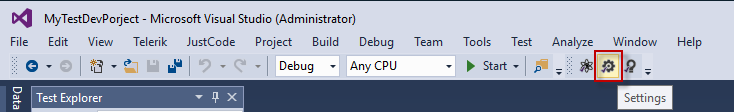

# Test Studio Project Settings

Each __Test Studio Dev__ project can be customized with different settings on project level. These could be accessed from the _Settings_ button in the project.

Use this dialog to configure how tests are recorded, fine tune how web page elements are located, extend Test Studio with new translators, and get information about the current installation. Keep in mind that many of these settings can be quite specific, so expect to use the defaults as you get started with Test Studio Dev and change the settings as you find need for these.

> These settings only apply to tests in the current project.

The available settings are divided in few areas:

- <a href="/features/project-settings/general" target="_blank">General Project Settings</a>
- <a href="/features/project-settings/recording-options" target="_blank">Recording Settings</a>
- <a href="/features/project-settings/element-images" target="_blank">Element Images Settings</a>
- <a href="/features/project-settings/browsers" target="_blank">Browsers Configuration Settings</a>
- <a href="/features/project-settings/emulated-device" target="_blank">Emulated Device Settings</a>
- <a href="/features/project-settings/find-logic" target="_blank">Find Logic (Html) Settings</a>
- <a href="/features/project-settings/updates" target="_blank">Updates Product Settings</a>
- <a href="/features/project-settings/translators" target="_blank">Translators Project Settings</a>
- <a href="/features/project-settings/analytics" target="_blank">Analytics Product Settings</a>
- <a href="/features/project-settings/logging" target="_blank">Logging Product Settings</a>