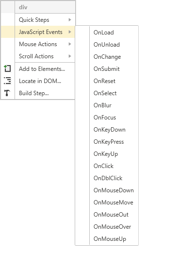
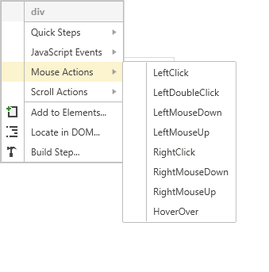

# Highlighting Elements

The __Highlighting__ feature in __Test Studio Dev Recorder__ allows you to inspect elements on page, add steps to enrich the automation beyond click and type actions, etc. Once the Highlighting is enabled you could hover over an element on page and pause the mouse shortly on it. A context menu appears providing relevant to the highlighted element functions.

The element's context menu content is divided in few sections which provides further options.

- **Quick Steps** - presents a context sensitive list of tasks that can be performed against the highlighted element, such as <a href="/features/recorder/verifications/quick-verification" target="_blank">build a verification</a> or create a <a href="/features/recorder/verifications/Wait" target="_blank">wait step</a> etc.

- **JavaScript Events** - can be invoked against the highlighted element.

- **Mouse Actions** - can be invoked, as if the user was directly using the mouse to click or hover the highlighted element. This option mimics a click on the button and is browser based.

- **Scroll Actions** - scrolls the highlighted element to the top or the bottom of the page.

- **Add to Elements** -  adds the highlighted element to the <a href="/features/elements-explorer/overview" target="_blank">Elements Explorer</a>.

- **Locate in DOM** - navigates to the <a href="/features/recorder/dom-explorer" target="_blank">DOM Explorer</a> and selects the corresponding element.

- **Build Step...** - highlights the element in the DOM and provide you bunch of actions you can take against the selected element - all of the above listed quick steps as well as the ability to add <a href="/features/recorder/verifications/advanced-verification" target="_blank">an advanced verification</a>.

