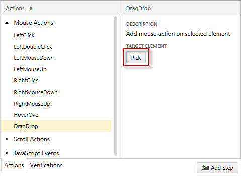
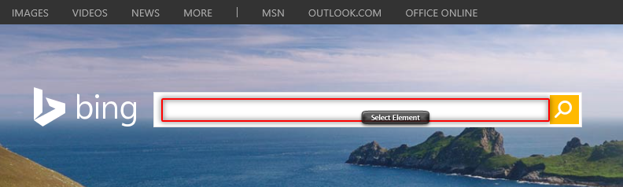
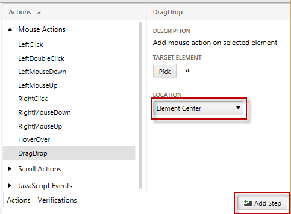
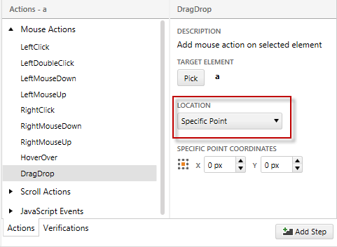
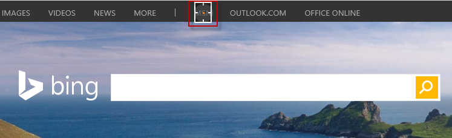

# Drag and Drop

1.&nbsp; Start <a href="/getting-started/test-recording/overview" target="_blank">recording a test</a>.

2.&nbsp; Enable Hover Over Highlighting from the Recording Toolbar. When the mouse pauses over a highlighted element in the recording surface the context menu with multiple options.

3.&nbsp; Highlight an element you want to drag and drop and click **Build Step**.

4.&nbsp; From Mouse Actions select **DragDrop** and click **Pick** button.

5.&nbsp; Highlight and select the target element where you want to drop the element.

6.&nbsp; Choose **Element Center** from the **Location** drop down to drop the element in the center of the target element and click **Add Step**. The Drag&Drop step is created in Test Studio.

## Drag and Drop to a specific location

Choose **Specific Point** from the **Location** drop down to specify the exact coordinates where to drop the element. 

Select against which part of the target element will be the specific point calculated from the grid.

Drag the circle to the point where you want to drop the element (the coordinates will be calculated automatically against the selected element) or type the coordinates manually.

Click **Add Step**. The Drag&Drop step is created in Test Studio.
