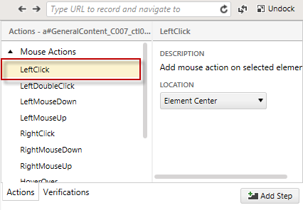
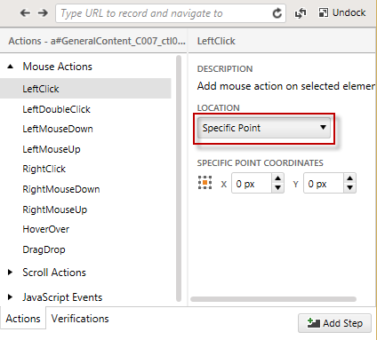
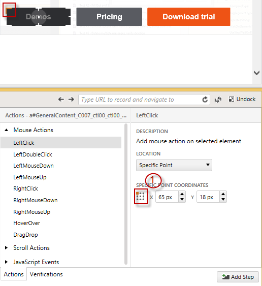
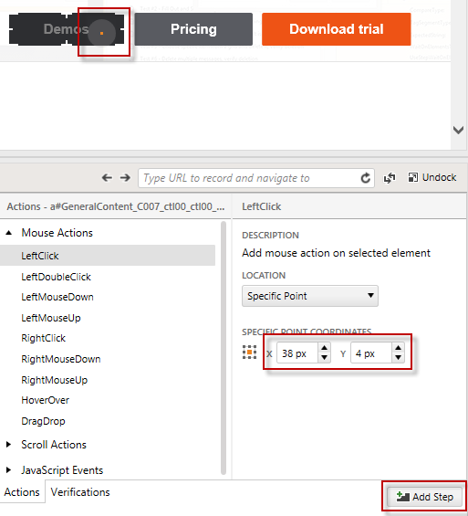

# Specific location

1.&nbsp; Start <a href="/getting-started/test-recording/overview" target="_blank">recording a test</a>.

2.&nbsp; Enable Hover Over Highlighting from the Recording Toolbar. When the mouse pauses over a highlighted element in the recording surface the context menu with multiple options.

3.&nbsp; Highlight an element and click **Build Step**.

4.&nbsp; Select the mouse click you want to perform.

> __Note:__ If you leave Element Center option the click will be performed in the center of the element.

5.&nbsp; Choose **Specific Point** from the Location drop down.

6.&nbsp; Select against which part of the element will be the specific point calculated from the grid (1).

7.&nbsp; Drag the circle to the point where you want to click (the coordinates will be calculated automatically) or type the coordinates manually and click Add Step.

