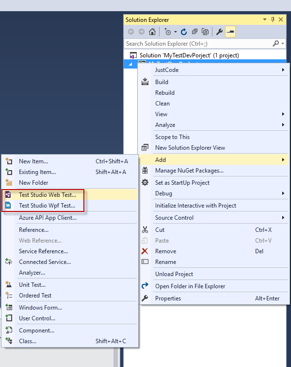
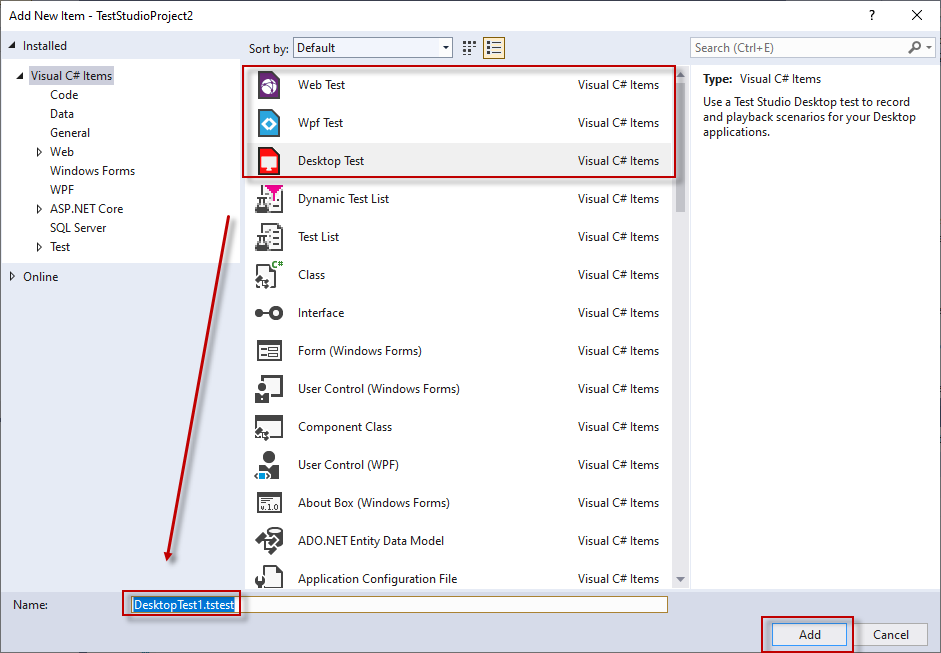
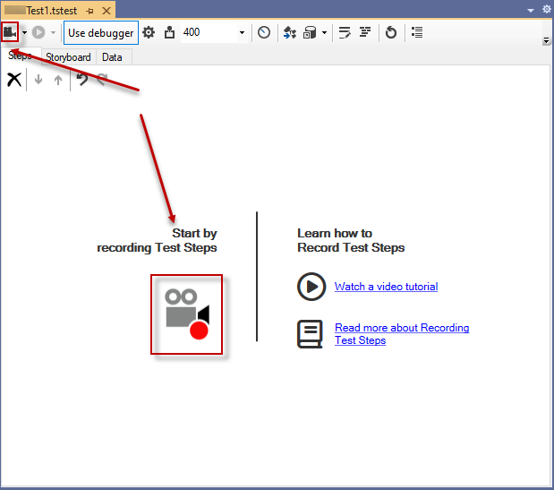
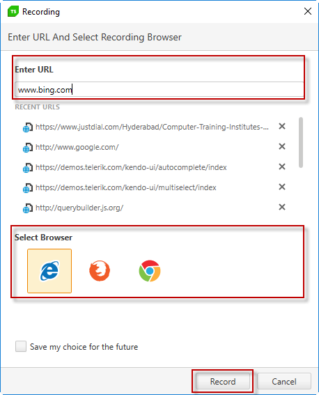
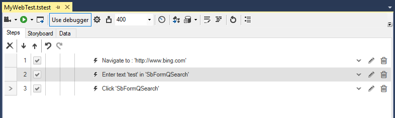
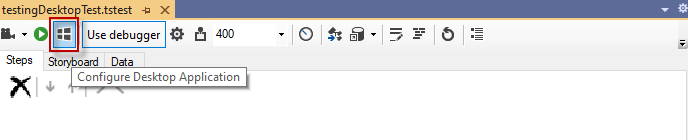
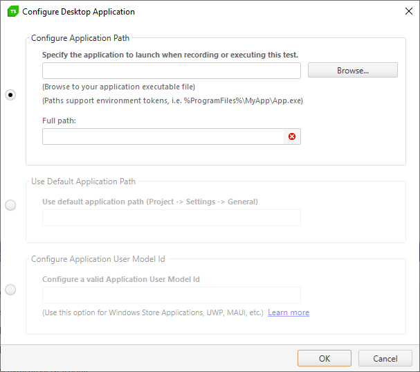

# Record a Test

Test Studio Dev Edition supports the recording feature for all types functional tests - web, WPF and desktop.

This article describes how to start a recording session for the different tests. 

## Add Test in the Project

Before you start recording add a new test in the project. 
- Right mouse click on the project name in _Solution Explorer_ opens its context menu; 
- Open _Add_ submenu and choose the type of test to add - __Test Studio Web Test...__, __Test Studio WPF Test...__ or __Test Studio Desktop Test...__.

The selected item is highlighted in the _Add New Item_ window and you can type a name for the test. Click _Add_ to include the test in the project and close that dialog.

## Record a Web Test

Double click a Web test from the _Solution Explorer_ to open it. Click on any of the _Record_ buttons to start the recording session.

In the dialog that pops up enter the URL to record against and select the recording browser. Click on __Record__ button to trigger the browser in recording mode.

The _Recent URLs_ section lists the recently used URLs and you can choose a page directly from the list.

> __Note__ 
>  
> Once a recording session is started __do not start another instance of the same browser__ until the session is finished!

When you hit the __Record__ button, the selected browser starts and navigates to the URL. Once the page loads the <a href="/features/recorder/recording-toolbar" target="_blank">Test Studio Dev Recorder Toolbar</a> gets attached to the browser and you can start performing the steps of the automation scenario. Each action against the page is automatically recorded and presented by a single step in the test.

> __Tip__ 
>  
> To stop the recording session close the browser.

## Record a WPF Test

Double click a WPF test from the _Solution Explorer_ to open it. Click on the _Configure WPF Application_ button.

The _Configure WPF Application Path_ wizard appears and allows you to select the application to launch for this WPF test.

* __WPF Application Path__ - use the __Browse__ button to insert the full path to the application executable file. You can use environment tokens (i.e. %Program Files%\MyApp\App.exe).
    * __Current Path Expanded__ - the field is read-only and display the full path to application.

* __Use default path__ - you can set a default path value on project level in <a href="/features/project-settings/general" target="_blank">Project Settings > General</a>. Enable this checkbox to use the predefined application path from Project settings. 

* __Active WPF Applications__ - Test Studio detects all currently running WPF apps and lists these. Highlight the desired app and press __Select Application__ to automatically populate the application's path.

* __Recording Options__ - whether to record window state changes.

Click on __OK__ button to confirm the configuration.

Once you have configured the test, click on any of the __Record__ buttons to launch a new instance of the tested application.

The <a href="/features/recorder/recording-toolbar" target="_blank">Test Studio Dev Recorder Toolbar</a> gets attached to the application instance and you can continue with performing the steps for the automation scenario. Each action against the application is automatically recorded and presented by a single step in the test.

> __Tip__ 
>  
> To stop the recording session close the WPF application.

## Record a Desktop Test

Double click a Desktop test from the _Solution Explorer_ to open it. Click on the _Configure Desktop Application_ button.

The _Configure Desktop Application_ wizard appears and allows you to choose the application to use for recording steps in this desktop test.

* __Configure Application Path__ - use the __Browse__ button to insert the full path to the application executable file. You can use environment tokens (i.e. %Program Files%\MyApp\App.exe).
    * __Full Path__ - the field is read-only and displays the full path to application.

* __Use Default Application Path__ - you can set a default path value on project level in <a href="/features/project-settings/general" target="_blank">Project Settings > General</a>. Enable this option to use the predefined application path from Project settings. 

* __Configure Application User Model Id__ - Windows store, UWP or Maui-based desktop applications cannot be started with an executable file. To enable this type of automation Test Studio Desktop tests support configuring a test using the <a href="https://docs.microsoft.com/en-us/windows/win32/shell/appids" target="_blank">Application User Model ID</a>. 

> __Tip__ 
>  
> __Not sure what is the Applications ID for the tested app?__ Follow <a href="https://docs.telerik.com/teststudio/automated-tests/desktop-testing/desktop-app-user-model-id" target="_blank">few simple steps to find the User Model Id</a> and use it in the Test Studio desktop test configuration.

Click the __OK__ button to confirm the configuration.

Once you have configured the test, click on any of the __Record__ buttons to launch a new instance of the tested application.

The <a href="/features/recorder/recording-toolbar" target="_blank">Test Studio Dev Recorder Toolbar</a> gets attached to the application instance and you can continue with performing the steps for the automation scenario. Each action against the application is automatically recorded and presented by a single step in the test. Find out <a href="https://docs.telerik.com/teststudio/automated-tests/desktop-testing/recording-specifics-desktop-test" target="_blank">here some specifics for the desktop tests recording</a>. 

> __Tip__ 
>  
> To stop the recording session close the desktop application.

## Attach the Recorder to a Running Instance

The Test Studio Dev Recording Toolbar can be attached to a running instance of __WPF application__ or __Internet Explorer__ only. Click the black arrow on the right side of _Record_ button and select the _Attach to_ option. 

The screenshot demonstrates the option for web test but is available in WPF test as well.