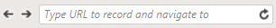

# Recording Toolbar

The recording toolbar gets attached to the selected browser for recording once it launches the provided valid URL. By default the toolbar is docked to the browser instance.

After entering a URL and pressing Enter/**Start Recording** button the recording toolbar is attached at the **bottom** of the browser:

It provides different functionalities to ease the recording process. 

## DOM Explorer Options

Below are listed its features related to the <a href="/features/recorder/dom-explorer" target="_blank">DOM explorer</a> and how you could use these during recording:

<table id="no-table" >
	<tr cellspacing="10">
		<td cellspacing="1"> </td>
		<td><a href="/features/recorder/highlighting-elements" target="_blank">**Enable/Disable Hover Over Highlighting**</a> (Use "**Pause/Break**" on your keyboard to toggle the highlighting on/off)</td>
	</tr>
	<tr cellspacing="10">
		<td></td>
		<td>**Pause Recording** (Use "**Print Screen**" on your keyboard to pause recording)</td>
	</tr>
	<tr>
		<td></td>
		<td>**Start Recording** (Use "**Print Screen**" on your keyboard to resume recording)</td>
	</tr>
	<tr>
		<td></td>
		<td>**Reconnect Recorder** - restores communication between Test Studio and the recording browser window or WPF app, if necessary</td>
	</tr>
	<tr>
		<td></td>
		<td>**Navigation panel** - during the recording session type URL to navigate to or refresh the browser</td>
	</tr>
	<tr>
		<td> / </td>
		<td>**Undock/Dock** - undock or dock back the recorder</td>
	</tr>
	<tr>
		<td></td>
		<td>**Add To Elements Repository** - add a single or multiple elements to the <a href="/features/elements-explorer/overview" target="_blank">Elements Explorer</a>)</td>
	</tr>
		<tr>
		<td>![Manual Refresh of the DOM][12]</td>
		<td>**Manual Refresh of the DOM** - Used when auto-refresh is paused and the DOM tree is changed</td>
	</tr>
	<tr>
		<td>![Freeze DOM tree][11] / ![Unfreeze DOM tree][11a]</td>
		<td>**Freeze/Unfreeze DOM tree** - Pause/Resume the DOM tree auto-refresh option</td>
	</tr>
	<tr>
		<td></td>
		<td>**Elements Tree/Tag View** - whether to display the elements as tree view or tag view</td>
	</tr>
<table>

## Step Builder Options

On the right side of the recording toolbar you can find the ***Actions*** and ***Verifications*** steps from the <a href="/features/recorder/step-builder" target="_blank">Step Builder</a>. Adding steps during recording is necessary in some special occasions - if you need a <a href="/features/recorder/mouse-actions/drag-and-drop" target="_blank">drag&drop step</a> or an <a href="/features/recorder/verifications/advanced-verification" target="_blank">advanced verification</a>.

Other possible scnearios when is recommended to use the Step Builder from the **Recorder Toolbar** are usually related to specific applications and how these are built. If *Record&Playback* doesn't work out of the box usually the structure of application does not allow recognition of separate elements identified by unique attributes. Then the only option left is to manually select the correct element in DOM explorer and add the necessary steps.

__See Also:__

* <a href="/features/recorder/highlighting-elements" target="_blank">Elements Menu</a>

* <a href="/features/elements-explorer/overview" target="_blank">Elements Explorer</a>

* <a href="/features/recorder/verifications/introduction" target="_blank">Verifications</a>

[11]: images/fig11-lock.png
[11a]: images/fig11-unlock.png
[12]: images/fig12-refresh.png