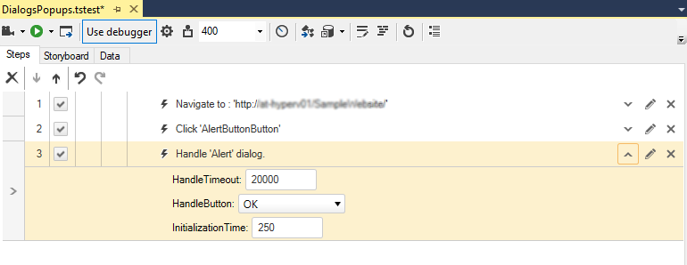
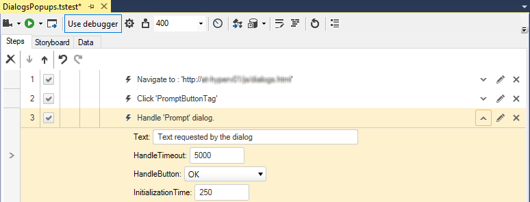
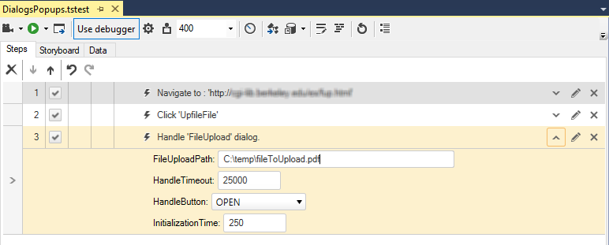
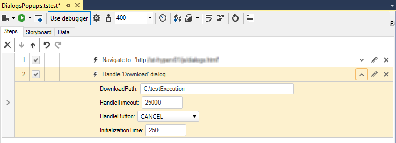

# Dialogs

Not all test steps play out directly inside the browser. Web pages can display popup dialog windows in the form of alerts, confirmations and Win32 dialogs, as well as other browser instances. __Test Studio Dev__ allows you to track and respond to dialog windows, handle HTML popups. 

The dialogs displayed by a browser can be either a browser window dialog, or a dialog displayed by the Windows operating system - the Win32 dialogs. __Test Studio Dev Recorder__ recognizes these and inserts automatically the appropriate handler into your test while recording your actions against the browser.

Some of the browser window dialogs and the recorded step to handle each of them are sampled below: 

__Handle Alert Dialog Step__

__Handle Confirm Dialog Step__

__Handle Prompt Dialog Step__

The Win32 dialogs - FileUpload and FileDownload - dialogs and the recorded step to handle these are sampled below:

__File Upload Dialog Step__

__File Download Dialog Step__

The dialog handlers can be added manually from the <a href="/features/recorder/step-builder" target="_blank">Step Builder</a> as well.
