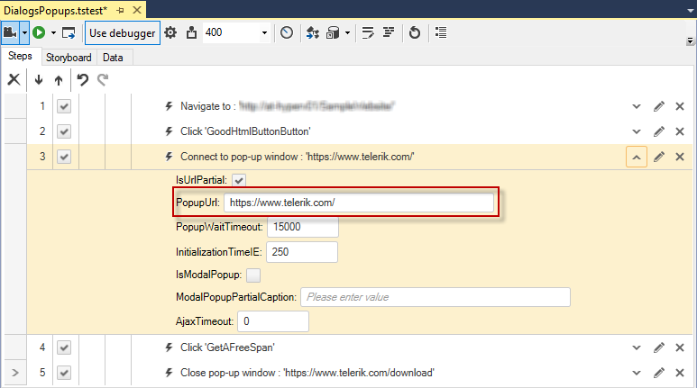
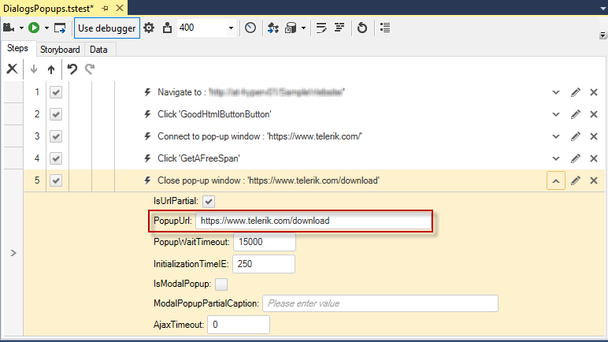
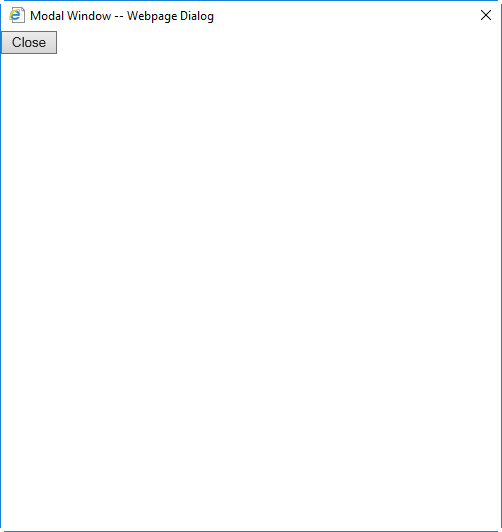
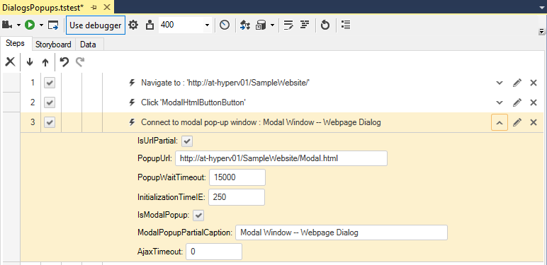

# HTML Popups

Not all test steps play out directly inside the browser. Web pages can display popup dialog windows in the form of alerts, confirmations and Win32 dialogs, as well as other browser instances. __Test Studio Dev__ allows you to track and respond to dialog windows, handle HTML popups. 

Typically an HTML popup is a new browser window opened in a new tab or a new browser instance. __Test Studio Dev Recorder__ automatically detects popup windows and attaches a new recorder toolbar to the new browser tab/instance - a _'Connect to Popup'_ step is recorded in the test. All actions performed in the popup window get automatically recorded followed by a _'Close Popup'_ step when the popup is dismissed. The popup is recognized by its URL.

__Connect to Popup Step__

__Close Popup Step__

>There's a limitation in Test Studio Dev in that it cannot tell the difference between the parent window and the popup window when __the URL is the same__. Test Studio Dev will randomly connect to the right or wrong one and you cannot control it.

## Popups with Dynamic Queries

If your web application typically loads popups with URLs that contain a dynamic portion, such as a search query, you will need to alter the _'Connect to pop-up window'_ step properties.

For example:

- Your Popup URL contains a dynamic query: http://www.domain.com/search?1234567890
- Set **IsUrlPartial** to True.
- Set **PopupUrl** to: http://www.domain.com/search

## Modal Popups (IE only)

> Modal Popups are deprecated for Chrome and Firefox browsers.

A Modal Popup window is a child window that requires users to interact with it before they can return to operating the parent application. Modal windows often have a different appearance than normal windows and are typically without navigation buttons and menu headings. Modal Popups are detected automatically by __Test Studio Dev Recorder__, like HTML Popups, however a separate recorder toolbar is __not__ attached.

Notice the difference between the *Connect to/Close modal pop-up window* and *Connect to/Close pop-up window* steps is the checkbox __'IsModalPopup'__ and the caption stored in __'ModalPopupPartialCaption'__. These are the properties which distinguish both types of connect and close steps.

- __IsModalPopup__ identifies whether the popup window is modal.
- __ModalPopupPartialCaption__ stores its partial caption and the desired modal popup can be located based on it.

