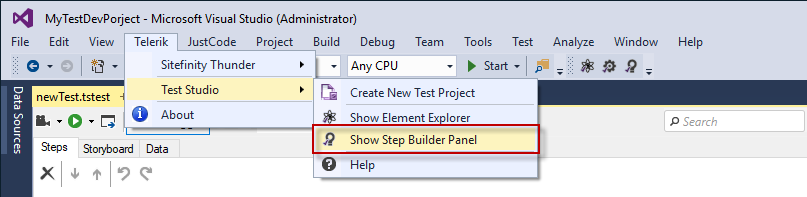
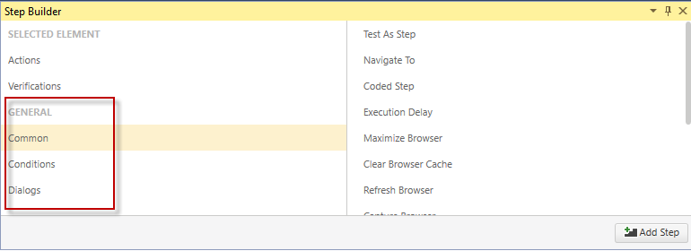

# Step Builder

The Step Builder provides options for adding steps based on the selected element in the DOM tree during a recording session.

The Step Builder on project level can also be used to build steps against already recorded elements in the Elements repository. To open the Step Builder in the project click the _Show Step Builder_ button in the upper ribbon or use the Telerik menu.

Furthermore it provides additional <a href="/features/custom-steps" target="_blank">custom steps</a> to enrich the automation scenarios.

