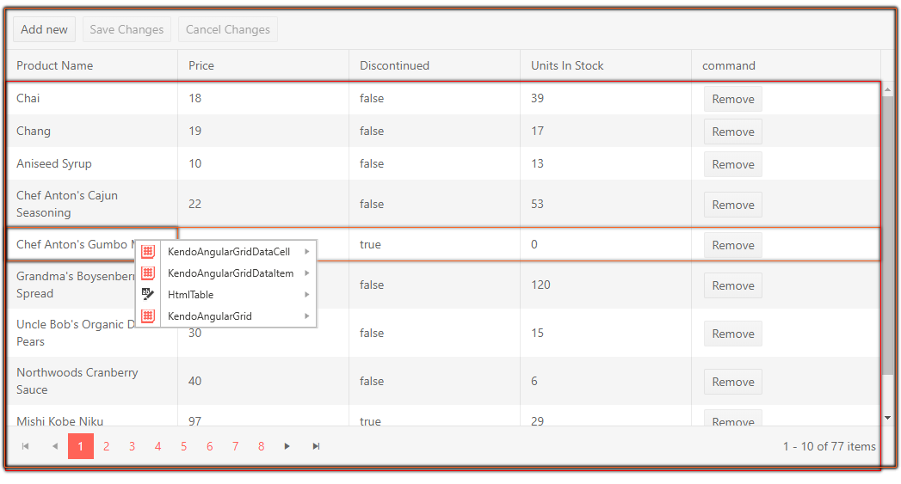
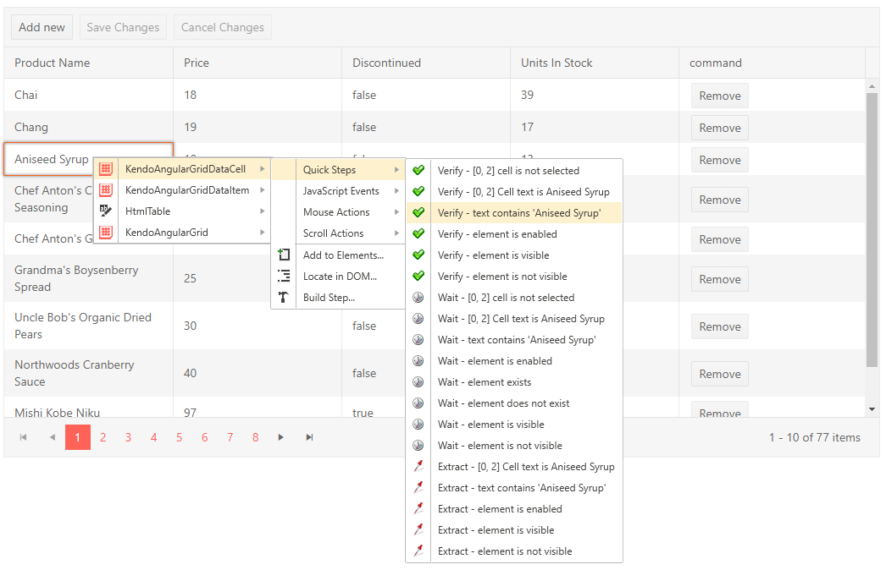

# Translators

The party that best understands the internals of a component is the party that built it. The Telerik extensibility model allows third party web component vendors to encapsulate deep knowledge of component internals to share with their customers.

* Translators are extensions that open up an element to work with Test Studio Dev.
* A translator describes the actions of an element that can be automated and verifications that can be performed.
* Translators allow interaction with the Test Studio Dev user interface including the <a href="/features/recorder/highlighting-elements" target="_blank">Elements Menu</a> and <a href="/features/elements-explorer/overview" target="_blank">Elements Explorer</a>.
* Test Studio Dev ships with basic translators for HTML, Silverlight and WPF, and translators built specifically for __Telerik AJAX and Silverlight RadControls, KendoUI for jQuery and KendoUI for Angular, Blazor__.
* Test Studio Dev was built with extensibility in mind, so as additional controls become available, new translators can be plugged in.
* Telerik is committed to maintaining translators in step with Telerik controls changes, so you can expect the translators to always be up-to-date.

As your mouse hovers over elements during the recording, the recording toolbar will fan out to indicate progressively more specific translators.

It shows enhanced highlighting in the form of colored borders around a "translated" element, indicating how elements are contained within one another. The translators for a KendoUI Angular Grid cell are shown in this example. The menu items represent:

* GridDataCell
* GridDataItem
* HtmlTable
* Grid

As the mouse passes over the items in the menu the respective element on page will be highlighted. Select the <a href="/features/recorder/verifications/quick-verification" target="_blank">Quick Steps</a> option on the Elements Menu. Common tasks are displayed for the specific element. The screenshot below shows verification and wait tasks for a particular grid cell. Without the translator you could not get to this level of detail easily.

Test Studio Dev comes with translators for HTML, Silverlight, and WPF and translators built specifically for Telerik AJAX and Silverlight RadControls, KendoUI for jQuery and KendoUI for Angular, Blazor. These translators have a "base" or "generic" group of intrinsic translators that are used whenever a more specific translator is not available. These translators are listed in the <a href="/features/project-settings/Translators" target="_blank">Project Settings</a> dialog.