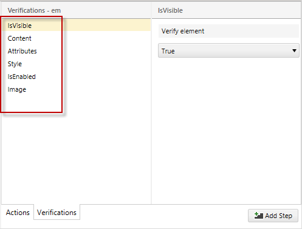
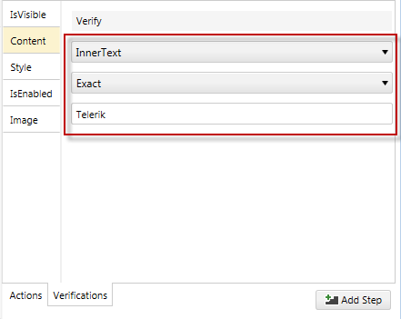
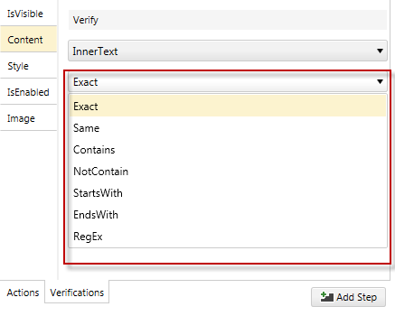
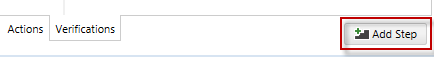

# Create Advanced Test Verifications

An advanced verification allows you to interactively build verification rules and validate them against a live web document or WPF application. In order to create custom verification you need to locate the target element in the DOM tree and use the Step Builder __(add a link)__ and its _Verification_ section. 

1.&nbsp; Create a Web Test and click Record.

2.&nbsp; Navigate to <a href="http://www.bing.com" target="_blank">www.bing.com</a>

3.&nbsp; Enter _Telerik_ in the search box and click the __Search__ button.

4.&nbsp; Enable hover over highlighting by clicking _Highlight Element_ in the __Test Studio Dev Recorder__.

5.&nbsp; Choose _Build Step..._ from the context menu which will locate the element in the DOM tree and display the available options in the Step Builder to add a custom step. 

6.&nbsp; Select the **Verifications** tab in the Step Builder.

7.&nbsp; Start by selecting a type of available Verifications for the selected element:

- IsVisible
- Content
- Attributes
- Style
- IsEnabled
- <a href="/features/recorder/verifications/image-verification" target="_blank">Image</a>

When crafting verifications, content is dynamically built against the currently selected element. As selections are made, default values are populated according to values the element contains.
For example, choose Content as the verification type and three menu options appear. 

Click on the drop downs for each option to see a list of possible values.

<table id="no-table">
<tr>
<td></td>
<td></td>
</tr>
<table>

8.&nbsp; Once finished building the verification(s), click **Add Step** to add it as a step to the current test.

The newly created verification appears in the test:

> We recommend against using the Content Markup validation types. They are fragile in the face of minor page changes, and different browsers may reorder the element attributes making them unreliable. For more information please see our Automated Testing blog entry on <a href="http://blogs.telerik.com/jimholmes/posts/11-08-23/understanding-validation-content-element-types.aspx" target="_blank">**Understanding Validation Content Element Types**</a>.
