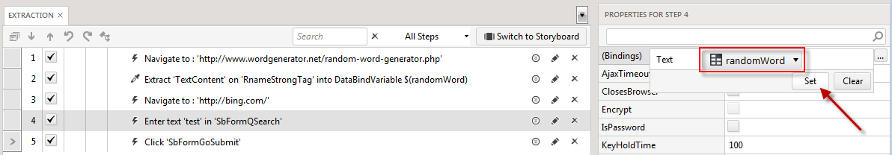
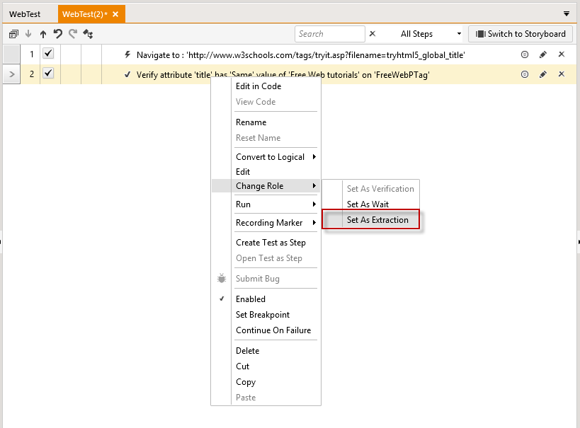
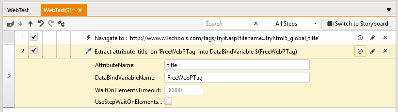

# Create an Extraction Step

An _Extraction_ step can be created in the same manner as <a href="/features/recorder/verifications/quick-verification" target="_blank">quick verification</a> step. Instead of verifying the value of the target element this step will export it to a an extracted variable which could be reused in the test later.

This example is against a <a href="http://www.wordgenerator.net/random-word-generator.php" target="_blank">random word generator site</a>.

1.&nbsp; Enable highlighting and hover over the target element, choose **Quick Steps > Extract - text contains** entry. 

2.&nbsp; An Extraction step is added to the test.

3.&nbsp; Pause recording, double click that step, and change the DataBindVariableName. In this example I renamed it to *randomWord*.

4.&nbsp; Resume recording and navigate to www.bing.com from the Navigation pane in the Recording toolbar __add a link__.

5.&nbsp; Enter any word into the search box and click **Submit**.

6.&nbsp; Close the browser to stop recording.

7.&nbsp; Select the step that enters a word for the search engine (step 4 in this example).

8.&nbsp; Click the **Bindings** __add a link__ drop-down in the **Properties** pane.

9.&nbsp; Select the extracted variable from the value drop-down and click **Set**.

10.&nbsp; Save and execute the test.

11.&nbsp; A random word is extracted from the first site and used as the query in a Bing search.

> __Double Check that in the plugin__ If you've <a href="/advanced-topics/coded-samples/general/extracted-variables-in-code" target="_blank">Set an Extracted Variable in Code</a>, type the variable name in the text box (without the $ notation), click on the brackets and then Set:

## Extract an attribute of an element##

1.&nbsp; Create an <a href="/features/recorder/verifications/advanced-verification" target="_blank">advanced verification</a> for an attribute of an element (e.g. Title).

If the element is **hidden** you should select it from the DOM Explorer

2.&nbsp; Change the role of the verification step to Extraction.

3.&nbsp; The step is changed to an extraction one.

> __Note!__ Each Verfication/Wait/Extract step could have it role changed between Verification, Wait, and Extraction (if based on text). Right click the step and select from the context menu __Change Role > Set As...__

__See Also:__

* <a href="/features/recorder/verifications/quick-verification" target="_blank">Quick verification</a>
* <a href="/features/recorder/verifications/advanced-verification" target="_blank">Wait step</a>
