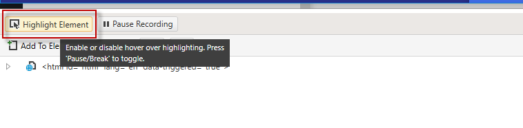
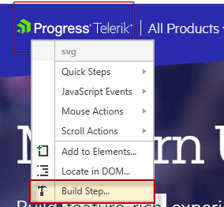
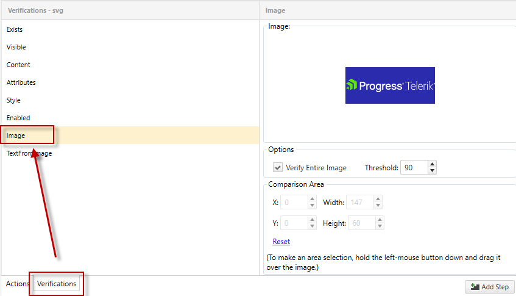
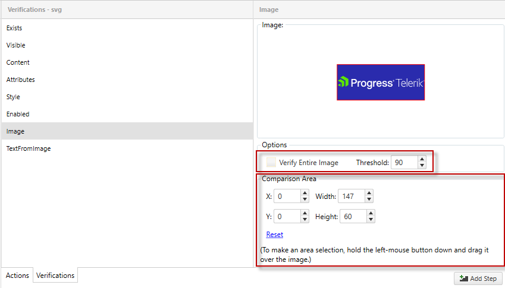
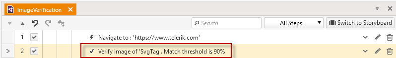
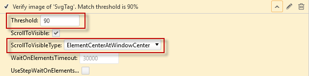

# Image Verification

You can build an image verification against specific elements for pixel-by-pixel visual verifications in tests. The image verification feature is based on an element’s visual rendering rather than the properties or attributes of that element. An application with rich graphic rendering can leverage this functionality to automate some of its test scenarios that have always needed manual visual inspection to verify. The image verification in Test Studio allows you to refine your verification area down to the pixel level within an element and also assign a threshold for the matching.

## Best practices

There are few things that could ensure more stable and reliable test execution:

   Use Image Verification when you need to verify an exact and static image, such as a logo, button, or icon.

   Do not use Image Verification to verify a specific color, an image with text content, or a dynamic slide show.

## How to record an image verification step

1. Create a Web Test and click Record.

2. Navigate to the application under test, for example www.Telerik.com.

3. Enable highlighting from the Recorder.

    

4. Hover over the image, for example the Progress Telerik logo in the header, and select **Build Step...** from the context menu.

    

5. In the Recorder click **Verifications > Image**.

    

    * __Web test__

    By default, **Verify Entire Image** is checked and the **Threshold** is set to 90%.

    > We recommend keeping the __Threshold__ around 90%. A setting of 100% equals an exact match and the verification will fail, if it is off by a single pixel.

    * __WPF test__

    By default, **Verify Entire Image** is checked and the **Tolerance** is set to 1%.

    > We recommend keeping the __Tolerance__ around 1% to 9%. A setting of 0% equals an exact match and increasing the tolerance means the verification is more forgiving.

6. Uncheck **Verify Entire Image** to refine the comparison area. Either enter coordinates or drag the desired selection area within the image.

    

7. Click **Add Step** and notice the Verify image step is added to the test.

    

## Configure the recorded image verification step

You can configure the threshold and scrolling options that will be used during test execution.

