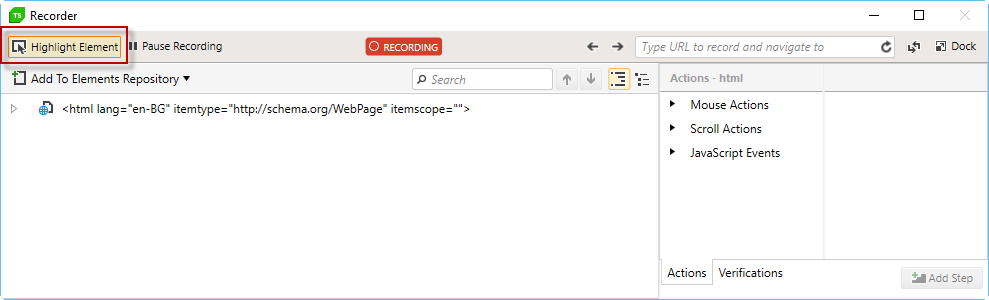
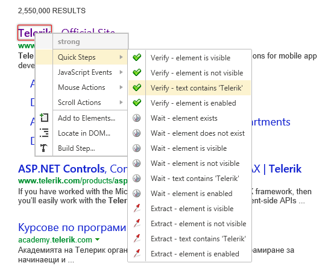

# Add a Quick Verification

The easiest and fastest way to add a _verification_ to your test is through the Quick Steps section in the element's context menu.

1.&nbsp; Create a Web Test and click Record.

2.&nbsp; Navigate to <a href="http://www.bing.com" target="_blank">www.bing.com</a>

3.&nbsp; Enter _Telerik_ in the search box and click the __Search__ button.

4.&nbsp; Enable hover over highlighting by clicking _Highlight Element_ in the __Test Studio Dev Recorder__.

5.&nbsp; In the recording browser window, hover over the element against which to verify. Choose **Quick Steps > Verify - text contains** entry.

6.&nbsp; The Verify step is added to the test.

> __Note!__ Each Verification/Wait/Extract step could have it role changed between Verification, Wait, and Extraction (if based on text). Right click the step and select from the context menu __Change Role > Set As...__

__See Also:__

* <a href="/features/recorder/verifications/quick-verification" target="_blank">Wait step</a>
* <a href="/features/recorder/verifications/advanced-verification" target="_blank">Extraction step</a>