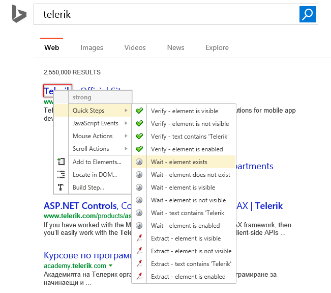

# Create a Wait Step

You can create a _Wait step_ in the same manner as a <a href="/features/recorder/verifications/quick-verification" target="_blank">quick verification</a> step. Instead of passing or failing based on a comparison, this step will wait for the comparison to be true before proceeding. The verification is performed after the server has responded.

1.&nbsp; Create a Web Test and click Record.

2.&nbsp; Navigate to <a href="http://www.bing.com" target="_blank">www.bing.com</a>

3.&nbsp; Enter _Telerik_ in the search box and click the __Search__ button.

4.&nbsp; Enable hover over highlighting by clicking _Highlight Element_ in the __Test Studio Dev Recorder__.

5.&nbsp; Highlight the desired element. From the menu that appears choose **Quick Steps > Wait - element exists**.

6.&nbsp; The Wait step is added to the test.

7.&nbsp; With the Wait step highlighted, you can see the test <a href="/features/test-maintenance/test-step-properties" target="_blank">**Step Properties** pane</a> where you can change the Check interval and the timeout.

> __Note!__ Each Verification/Wait/Extract step could have it role changed between Verification, Wait, and Extraction (if based on text). Right click the step and select from the context menu __Change Role > Set As...__

__See Also:__

* <a href="/features/recorder/verifications/quick-verification" target="_blank">Quick verification</a>
* <a href="/features/recorder/verifications/advanced-verification" target="_blank">Advanced verification</a>