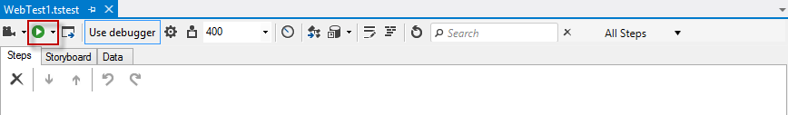
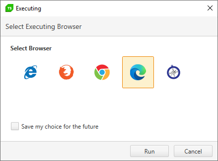
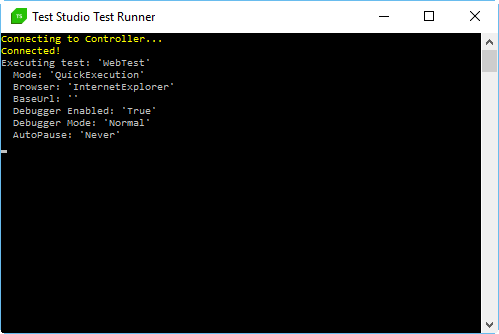
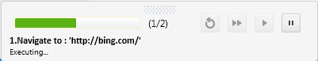
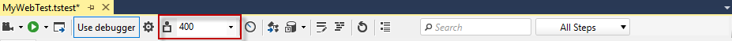
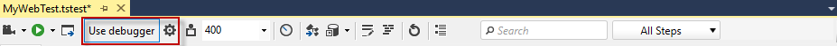
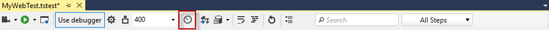
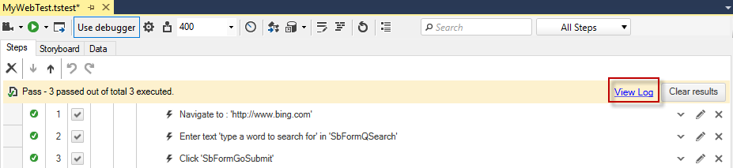

# Quick Execution

Quick execution allows you to easily find out if a test is configured and designed for stable future execution. It provides <a href="/features/test-maintenance/steps-pane#Execution-Related-Options-in-the-Steps-Pane" target="_blank">many options</a> to support you in debugging a failed test. How these could be helpful is described below in this article. 

> While a test is being executed **do not start another instance of the same browser** until the run is finished!

## Execute a Test

1. Once a test scenario is already recorded, click the **Execute** button in the test step pane.

1.1. Select the execution browser. This step will be skipped if you have already set a preferred browser from the <a href="/features/project-settings/browsers" target="_blank">Project Settings Browsers tab</a>.

2. The Test Studio Dev Test Runner launches first in a command prompt window. This calls the set browser or application.

## Visual Debugger

By default in the lower right of your screen there is a ribbon which indicates the current step, includes play and pause ability, and shows additional Debug Options if you set a <a href="/features/test-maintenance/steps-pane" target="_blank">Breakpoint to any step</a>. This is the <a href="/features/failed-tests-debugging/using-the-visual-debugger" target="_blank">visual debugger</a> and is a feature you could turn on or off. 

## Execute with Annotation

Click **Toggle Annotation** button to have the browser annotate each step with a brief message and by highlighting the target element for each step. Note that this will slow the test run down by inserting a delay between steps (in milliseconds) you set either from the dropdown menu or by entering a custom value.

## Debugger Options

Click **Debugger Options** icon to to turn the debugger on/off and customize the Auto-Pause Options, if errors occur during the execution.

## Execution Timeouts

Quick access to change the default timeouts for **Wait on elements** and **Client ready** is also available through the test step pane.

## Execution Results 

Afterwards, when the test execution is complete, test results are automatically generated and can be reviewed. Click **View Log** for test results details.

