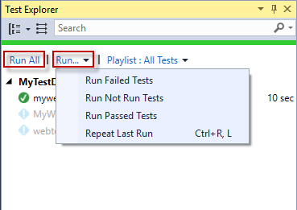
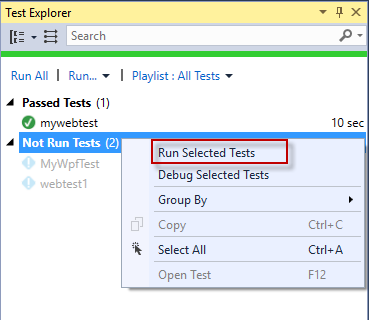

# Visual Studio Test Explorer#

The <a href="http://msdn.microsoft.com/en-us/library/hh270865.aspx" target="_blank">Test Explorer</a> in Visual Studio discovers and runs tests, including Test Studio Dev tests.

To open Test Explorer go to **Test > Windows > Test Explorer**:

![Test tab][1]

Test Explorer lists the __Test Studio Dev__ tests within the currently opened solution with their execution status in the Test Explorer. Thus a test executed with the Quick Execution Test Runner will still remain _Not Run_ in the Test Explorer until it is executed.

![Test Explorer][2]

>__Note!__ Ensure the __project is re-built before initiating a run from the VS Test Explorer__. Any recent changes will not be reflected otherwise.

__Test Studio Dev__ tests can be sorted in the Test Explorer by:

* __Outcome__ - sorts tests in Passed, Failed, Not Run categories.
* __Project__ - in case more than one __Test Studio Dev__ project is included in the solution the tests will be sorted by project.
* __Duration__ - sort the executed tests by the test run duration.

Run the tests with the _Run All_ button. Or choose a group of tests to run from the dropdown options of the _Run..._ button in Test Explorer.

Test Explorer allows you to run all tests previously sorted in a group (_Outcome, Project and Duration_ are the applicable categories for Test Studio Dev tests).

>__Note!__ By default VS Test Explorer __does not use__ the default <a href="/features/project-settings/overview" target="_blank">Test Studio Dev settings</a>. To be able to use the default or apply new settings a <a href="/advanced-topics/project-configuration/test-explorer-settings" target="_blank">project settings file is required.

[1]: images/vs-test-explorer/fig1.png
[2]: images/vs-test-explorer/fig2.png
