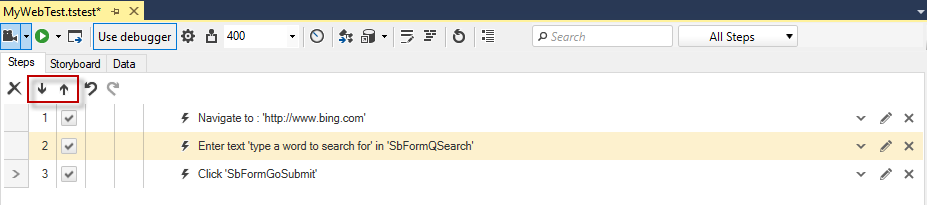
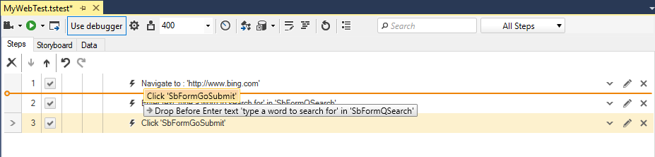
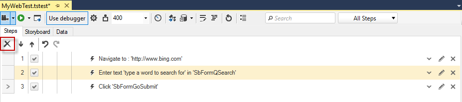
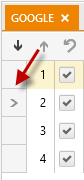

# Reorder Test Steps

You can easily change the order of existing test steps.

1. Use the **Move Step Down** and **Move Step Up** icons in the Steps pane. You can Ctrl + Click multiple steps and then move them together.

    

2. The next method is to drag and drop. You can Ctrl + Click multiple steps and then drag them together.

    

3. Use the standard keyboard shortcuts to Cut (Ctrl+X), Copy(Ctrl+C) and Paste (Ctrl+V) steps into the step pane. Multiple steps could be selected with Ctrl + Click and perform all of the above actions.

All steps could be deleted at once with the Clear All button - 

4. To choose where to insert new steps from the step builder or paste any copied steps click the gray box to the left of the step number. An arrow will appear next to that step and any new steps will be inserted after that one selected.

