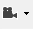
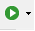
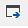
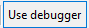
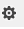
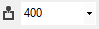
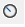
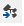
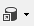

# Steps Pane Overview

The Steps pane provides useful options to reorder and edit the steps. You could also set different settings for the Test Studio Dev <a href="/features/test-execution/quick-execution" target="_blank">Quick Execution</a>.

![Step Pane][1]

The steps are listed in the order they will be executed for the current test run. Below is a list with description for the available options to modify and reorder steps.

| Feature | What to be used for |
| ------ | ------ |
| ![Move Step Down][3] | **Move Step Down** - Move the selected step(s) down one in the sequence |
| ![Move Step Up][4] | **Move Step Up** - Move the selected step(s) up one in the sequence |
| ![Undo][5] | **Undo** - Restore a step you just deleted or changed to its previous state and location |
| ![Redo][6] | **Redo** - Reapply the edit that was undone with the Undo button |
| ![Step Marker][8] | **Step Marker** - Set the step marker to denote where to insert newly recorded/added steps |
| ![Step Order][9] | **Step Order** - The step's place in the test sequence |
| ![Enabled Checkbox][10] | **Enabled Checkbox** - Whether the step will run during execution |
| ![Breakpoint][11] | **Breakpoint** -  Indicates whether the test will pause at that step and show Debug Options. (This is not applicable when set in a test inserted as Test as Step. Use the Execution > Pause Test Step Property instead) |
| ![Continue on Failure][12] | **Continue on Failure** - Indicates whether the test will stop if that step detects a failure |
| ![Step Type][13] | **Step Type** - Represents the type of step: Action, Verification, Coded, etc. |
| ![Description][14] | **Description** - The default description given to the step by Test Studio |
| ![Edit Custom Description][15] | **Edit Custom Description** - Alter the default step description |
| ![Show Inline Editor][16] | **Show Inline Editor** - Edit some of the step properties |
| ![Delete][18] | **Delete** - Removes the step from the test |
| ![Step Type Filter][19] | __Step Type Filter__ - <a href="/features/test-maintenance/search-test-steps" target="_blank">Filter test steps</a> by type |

## Execution Related Options in the Steps Pane

The available options related to test execution in the Step pane are listed below with short description. 

| Feature | What to be used for |
| ------ | ------ |
|  | __Record Button__ - Start recording a test |
|  | __Execute Button__ - Start executing a test |
|  | __Configure Silverlight Out-Of-Browser__ - Configure the test to run against a Silverlight application |
|  | __Debugger__ - Whether to display the visual debugger during test execution |
|  | __Debugger Options__ - When the debugger to pause the test execution |
|  | __Use Annotations__ - Turn on/off the annotations during test execution and the time (in miliseconds) to show the annotation  |
|  | __Quick Execution Options__ - Timeouts to set for the quick execution |
|  | __Generate Unit Test__  |
|  | __Data Sources__ - Manage the data sources for data driven testing approach |
|  | __Add Code Behind__ - Creates a code behind file for this test or opens the existing one |
|  | __Code Preview__ - Displays the code for all steps in test |
|  | __Recapture Storyboard__ - Recaptures new screenshots for the storyboard view of test |
|  | __Test Properties__ - Displays the test properties |

[1]: images/steps-pane/fig1.png

[3]: images/steps-pane/fig3.png
[4]: images/steps-pane/fig4.png
[5]: images/steps-pane/fig5.png
[6]: images/steps-pane/fig6.png

[8]: images/steps-pane/fig8.png
[9]: images/steps-pane/fig9.png
[10]: images/steps-pane/fig10.png
[11]: images/steps-pane/fig11.png
[12]: images/steps-pane/fig12.png
[13]: images/steps-pane/fig13.png
[14]: images/steps-pane/fig14.png
[15]: images/steps-pane/fig15.png
[16]: images/steps-pane/fig16.png

[18]: images/steps-pane/fig18.png
[19]: images/steps-pane/fig19.png