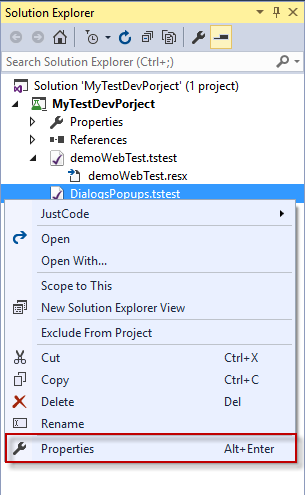

# Test Properties

Each test in the project exposes the properties of an existing file in the solution as well as Test Studio Dev related properties which concerns the test execution.

## Properties of File in the Solution

Selecting the _Properties_ option from the right click context menu in the Solution explorer opens the Properties pane for the test as an existing file in the current solution.

The Visual Studio Property pane displays the selected file properties. These are standard for any file in the project/solution.

## Test Properties Related to Test Studio Dev

The test properties which concern the test execution can be accessed by clicking the Properties Button in the test ribbon.

![Test Properties Button][1]

Here is a list of all test properties with a brief description of each:

**Execution**

- BrowserType - sets the browser the test executes on. Overrides the Settings.DefaultBrowser.
- DisableDialogMonitoring - whether to disable dialog handling.
- ReuseAppWindow - useful in data-driven execution to define the number of iterations to reuse the application window. By default ('0') keeps the same application open during the entire test run.
- SilverlightEnabled - whether to enable Silverlight automation for this test case.
- StopTestListOnFailure - gets or sets whether to stop test list execution if this test fails.
- WebKitExecutionDelay - explicit commands delay in milliseconds for the WebKit browsers (Safari & Chrome).

**Misc**

- CustomProperty - three user defined values.
- HasCodeBehind* - whether this test has code/script associated with it.
- IsManual - switch between manual and automated to designate whether to execute the test with the manual or automated test runner.

**Data**

- DataEnabled - whether to use the data source associated with this test to data drive the test.
- DataRange - defines a data range to execute within the data source set on a data driven test. Range is 1 based. Format: 'StartRow:EndRow' [i.e. '3:5'] or 'SingleRow' or ':3' (first three) or '3:' (three to end).
- DataType - the data source type associated with this test.
- DefaultToGrid - when the BuiltInGrid is created in addition to an external data source, if set will default to the BuiltInGrid, else the external source.
- HasBuiltInGrid* - whether a BuiltInGrid is attached to this test.
- InheritParentDataSource - gets or sets whether this data-bound test will inherit the data source from its parent data-bound test.
- IsDataDriven* - whether the test is data driven.
- Source* - the data source bound to this test. 

**Attributes**

- Description - description of this test.
- Name* - the name of this test.
- Owner - this test's owner.
- Path* - the test file path relative to the project.
- Priority - this test's priority (default is 0).
- UniqueId* - the test case unique identifier generated by Test Studio.

> *Indicates field is read-only.

[1]: images/test-properties-vs/fig1.png
