# Activate Test Studio Dev License

After installing Test Studio Dev, you will be asked to activate your license. During this process, your machine creates its own unique key and provides it to our server. We use this key to generate a unique license key for the installation of the product.

> All users, both trial and purchased, will need to activate their product after installation before they can begin using the tool.





## Activate Test Studio Dev License 

Start your Visual Studio and you get prompted from the __Test Studio Activation wizard__. Once you login with your Telerik.com account you can activate your license. 

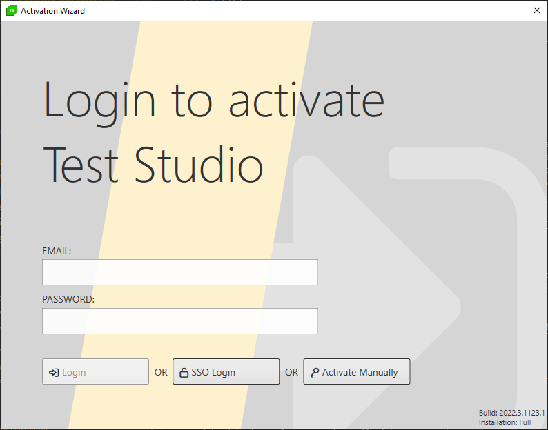

### Login with Your Telerik Account

You can enter the Telerik account credentials directly in the __Activation wizard__ and use the __Login__ button to login. 

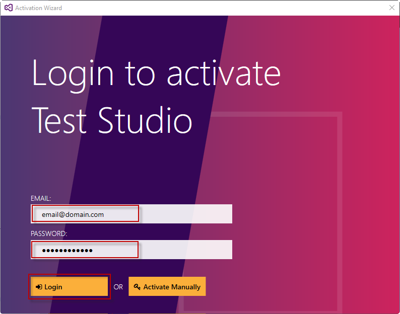

Choose the __SSO Login__ button to authenticate in a browser.

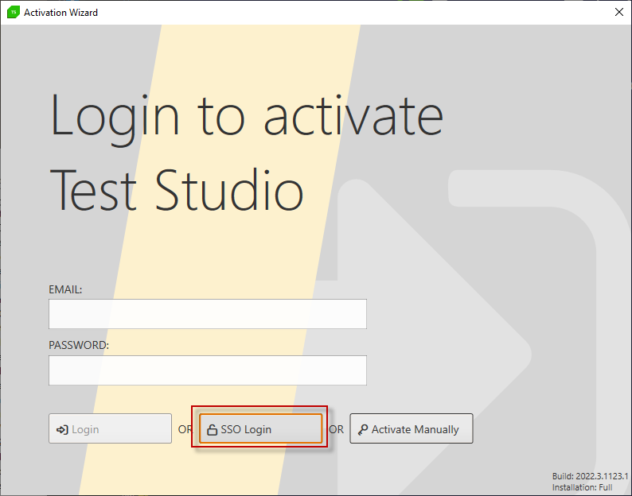

The default set browser opens up and redirects you to the Telerik account login page - follow the on-screen instructions to enter your Telerik username and password and login. 

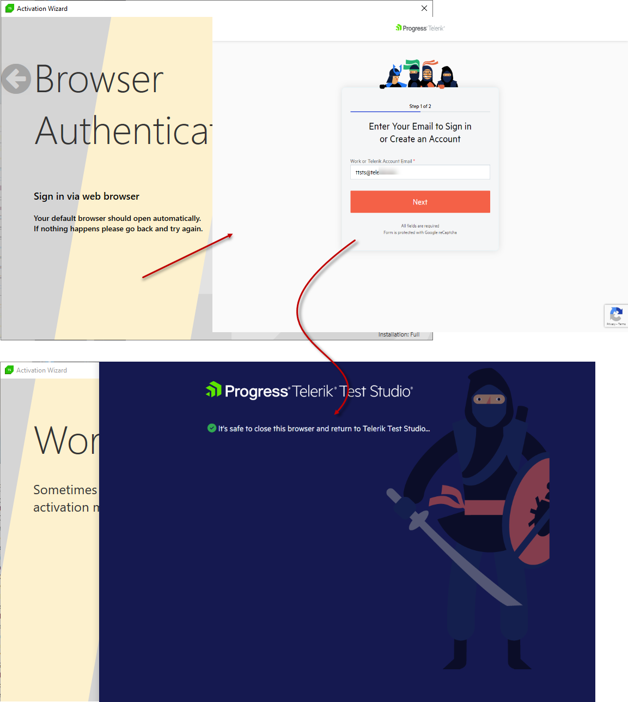

If you are already logged in to the Telerik.com page in the same browser, the authentication gets checked and you can proceed with choosing the version to activate.

### Choose License

Select the DevCraft license and click __'Activate Selected License'__. 

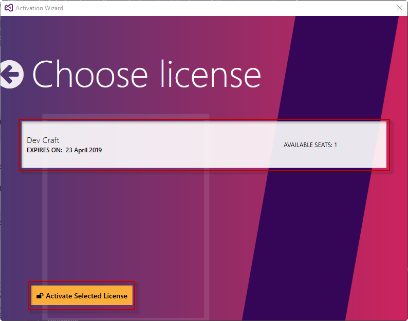

## Manual Activation

The following steps demonstrate how to manually activate Test Studio on a machine without Internet connection. 

> __Note__ 
> 
> While the machine that runs Test Studio may not be connected to the Internet, you need access on another device to the Internet and our website to complete the activation process.

1.Select __Activate Manually__.

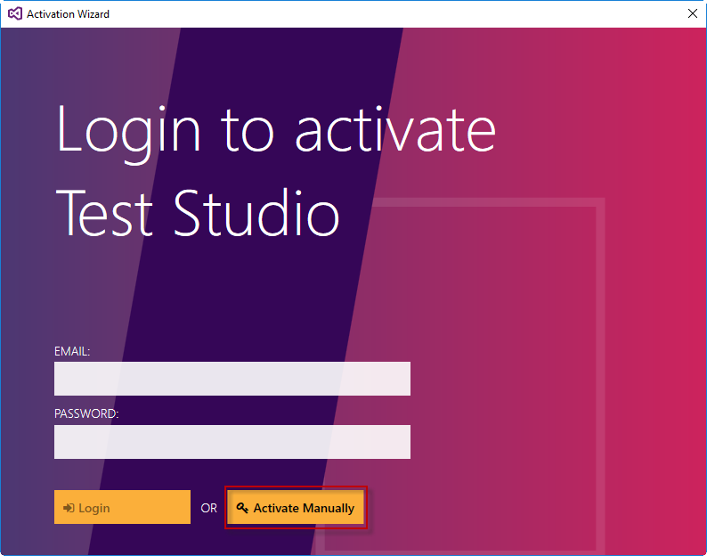

2.Copy your machine key from the __Machine Info Key__ field for later use.

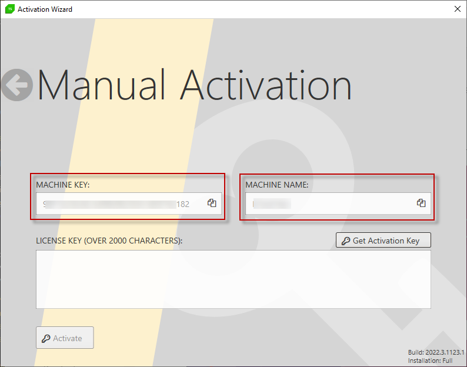

3.Navigate to the <a href="https://www.telerik.com/account/your-products/testing-tools-manage-license-keys" target="_blank">License Keys Management Form</a> and click the _Add a key_ button.

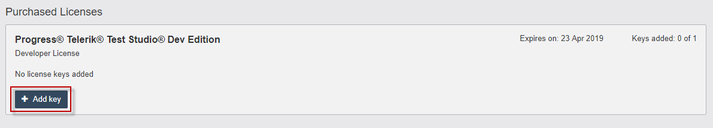

4.Select Product from the drop down menu. Input your machine info key within the provided field, the machine name and friendly name, then click the Generate Key button. 

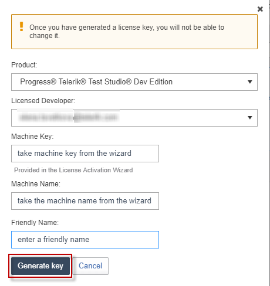

> There are reserved words that cannot be used for Machine key, Machine name and Friendly name. The words are **telerik**, **admin**, **administrator**, **sitefinity**, **icenium**, **kendo**, **kendoui** and **moderator**. 

5.A confirmation appears that the Key was successfully created. Locate the key and click __View key__.

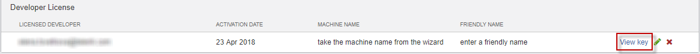

6.Select and copy the registration key. Then paste it within the respective field in Test Studio Dev Activation wizard, then click __Activate__.

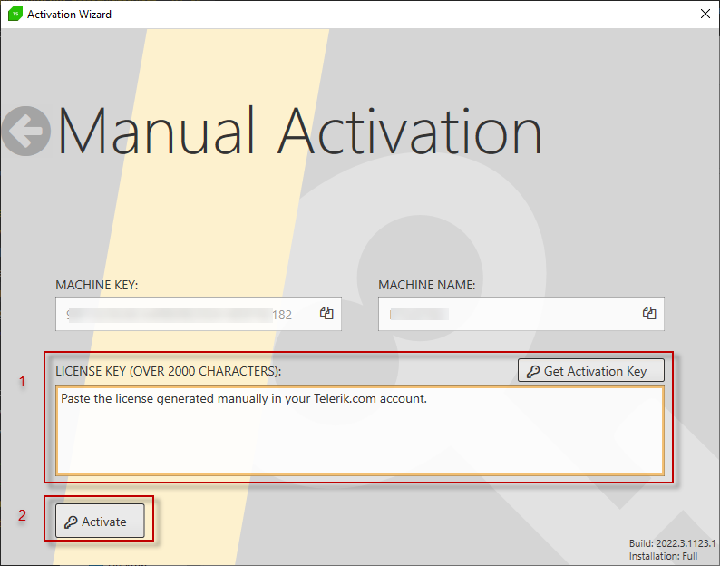

>If your machine was freshly imaged or replaced and you need to re-activate your license (0 seats available) on the new machine, please visit <a href="/advanced-topics/installation/re-activating-your-license" target="_blank">Re-Activating your License</a> article.