

# Calibrate Browsers

To be able to run tests using __Test Studio Dev__ against any browser it needs to be configured accordingly. In this article you can find the required settings for each of the supported browsers which will ensure flawless and consistent automation process.

## Built-in Calibration

We call that browser is __calibrated__ if the required settings are applied. __Test Studio Dev__ provides a built-in configuration approach which will set all necessary settings for the supported browsers out of the box and no manual interaction is required. To use our built-in feature open the _Test Studio Dev Settings_ window and switch to its _Browser_ tab.

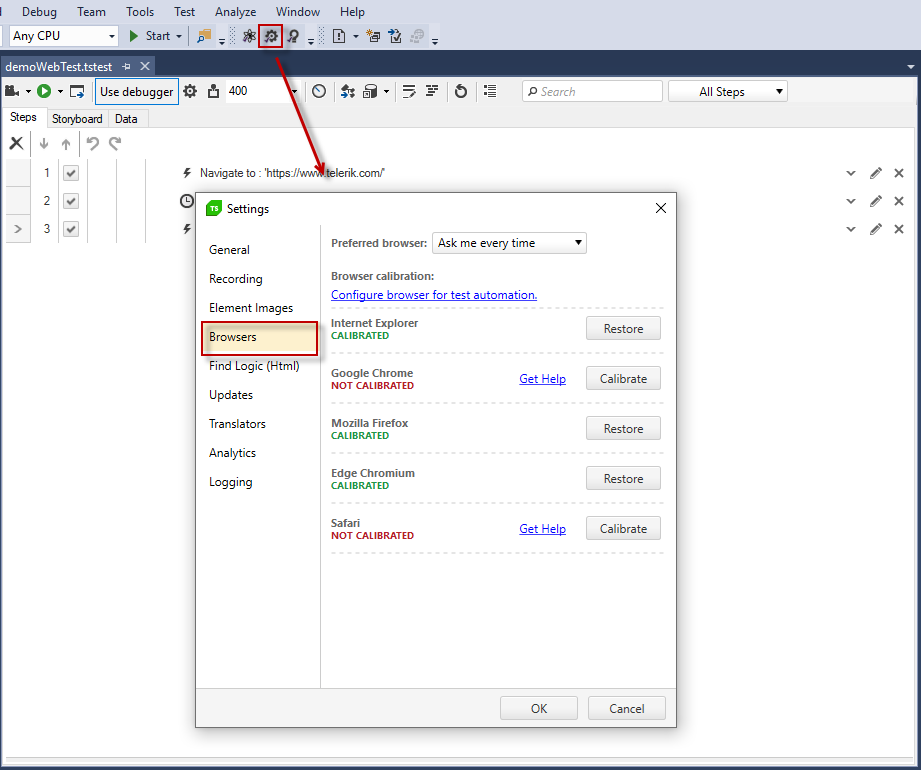

In the _Browser_ tab there is a list with the installed browsers on the current machine with a _Calibrate/Restore_ button next to each. If a browser is successfully calibrated the button allows you to restore its previous settings.

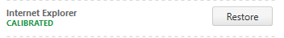

If a browser is not yet configured the button allows you to calibrate it. 

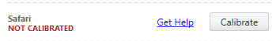

> __Note!__ During browser calibration __Test Studio Dev__ will automatically close all of currently running browser instances. Therefore before proceeding with calibration ensure there is no important information you might lose if browser gets closed.  

> __Note!__ if you need to check the settings applied from Test Studio Dev, you can scroll to the bottom of the article and check the section for <a href="#manual-settings-to-configure-a-browser", target=blank>Manual Browser Calibration</a>.

## Install Extensions for Firefox, Chrome and Micorosft Edge Chromium

Chrome and Firefox browsers require an extension for the purposes of automation testing with __Test Studio Dev__. 

- The __Chrome__ extension can be found in the Chrome web store - <a href="https://chrome.google.com/webstore/detail/progress-test-studio-exte/gegcllkonmciadpdldechnepmjildoan", target=blank>__Progress Test Studio Extension__</a>.

- The __Firefox__ extension can be found in the Firefox Add-ons Page - <a href="https://addons.mozilla.org/en-US/firefox/addon/progress-test-studio-extension/", target=blank>__Progress Test Studio Extension__</a>.

- The __Edge Chromium__ browser can now use extensions from the Chrome store and this will be used until Test Studio extension is published in the official Edge store. The extension is listed in the Chrome web store - <a href="https://chrome.google.com/webstore/detail/progress-test-studio-exte/gegcllkonmciadpdldechnepmjildoan", target=blank>__Progress Test Studio Extension__</a>.

## Add WebDriver for Microsoft Edge (if Still Using the Old Version of MS Edge)

The __deprecated version of MS Edge gets replaced once you install the new Microsoft Edge Chromium__. If you still haven't upgraded to it, you can use the previous version of the browser. In order to use **the MS Edge** browser for Test Studio automation you need to install **Microsoft WebDriver**. Depending on your Windows 10 build you should choose the correct WebDriver.

Determine your Windows 10 build and download the correct MS WebDriver from <a href="https://developer.microsoft.com/en-us/microsoft-edge/tools/webdriver/" target="_blank">here</a>.

### Windows 10 Anniversary Update (build 14393) And Later

>**Note!** The following steps apply for Windows 10 **Anniversary Update (build 14393)** and later. If you don't use it skip to the Automatic Calibration</a> step.

Microsoft WebDriver for that particular build doesn't include installer (\*.msi) but only \*.exe file. You should manually locate the WebDriver exe file in the Test Studio project settings.

### Windows versions prior Windows 10 Anniversary Update

1.1 &nbsp; Download Microsoft WebDriver for release 14393 from <a href="https://developer.microsoft.com/en-us/microsoft-edge/tools/webdriver/" target="_blank">here</a> and save it on your computer.

1.2 &nbsp; Locate WebDriver from the **Project Settings -> Browsers**

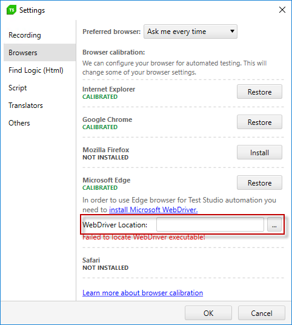

1.3 &nbsp; Navigate to the download location and select WebDriver exe file.

1.4 &nbsp; The location of WebDriver is now successfully set

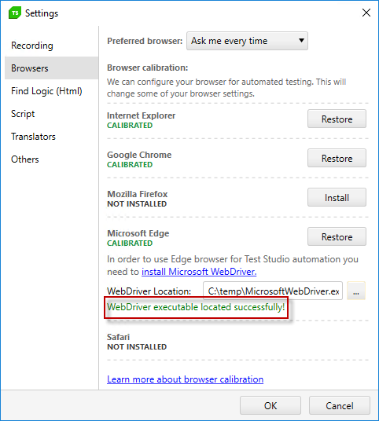

## Manual Settings to Configure a Browser

### Internet Explorer

If you need to double check manually if all settings are correct expand the <a href="#Manual_Configuration">Manual Configuration</a> section below.

<a name="Manual_Configuration" style="color:black; text-decoration: none;";>Manual Configuration +</a>

<h3>Zoom Level Set to 100%</h3>

1. Go to the higher right of the browser.  
2. Click Tools button -> <strong>Zoom</strong>.  
3. Select 100% (or use the keyboard shortcut: Ctrl + 0).  

  

<h3>Disable Protected Mode</h3>

1. Click <strong>Tools > Internet Options</strong>.    
2. Click the <strong>Security</strong> tab.  
3. Uncheck the <strong>Enable Protected Mode</strong> checkbox.  
4. Repeat step 3 for:  
- <strong>Internet</strong>  
- <strong>Local intranet</strong>  
- <strong>Trusted sites</strong>  

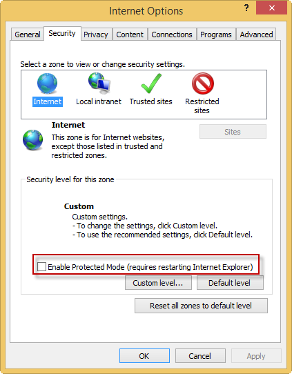  

<h3>Disable Pop-up Blocker</h3>

1. Click <strong>Tools > Internet Options</strong>  
2. Click the <strong>Privacy</strong> tab.  
3. Uncheck the <strong>Turn on Pop-up Blocker</strong> checkbox.  

  

<h3>Pop-ups Open in a New Window</h3>

1. Click <strong>Tools > Internet Options</strong>.  
2. On the <strong>General tab</strong>, click the <strong>Settings</strong> button for </strong>Change how webpages are displayed in tabs</strong>.  
3. Select <strong>Always open pop-ups in a new window</strong>.  

  

<h3>Add the Websites to List of Trusted Sites</h3>

1. Click <strong>Tools > Internet Options</strong>.  
2. Click the <strong>Security</strong> tab.  
3. Click on <strong>Trusted sites</strong>.  
4. Click the <strong>Sites</strong> button.  
5. If your site is not secure (uses HTTPS protocol), then uncheck the <strong>Require server verification</strong>... checkbox.  
6. Enter the URL of your website in <strong>Add this website to the zone</strong> text box. This text box will accept both DNS names and IP addresses.  
7. Click <strong>Add</strong>.  
8. Repeat steps 6-7 for each website you'll be testing.  

  

<h3>Disable Trusted Sites Message</h3>

1. Click <strong>Tools > Internet Options</strong>.  
2. Click the <strong>Security</strong> tab.  
3. Click <strong>Trusted sites</strong> and then <strong>Custom level</strong>.  
4. Scroll down until you find the <strong>Websites in less privileged web content zone</strong> can navigate into this zone under the <strong>Miscellaneous heading</strong>.  
5. Check <strong>Enable</strong>.  

  

<h3>Ensure JavaScript Is Enabled</h3>

1. Click <strong>Tools > Internet Options</strong>.  
2. Click the <strong>Security</strong> tab.  
3. Click <strong>Trusted sites</strong> and then <strong>Custom level</strong>.   
4. Scroll down until you find the <strong>Active scripting</strong> setting under the <strong>Scripting</strong> heading.  
5. Check <strong>Enable</strong>.  

  

<h3>Disable Mixed Content Message</h3>

1. Click <strong>Tools > Internet Options</strong>.  
2. Click the <strong>Security</strong> tab.  
3. Click <strong>Trusted sites</strong> and then <strong>Custom level</strong>.   
4. Scroll down until you find the <strong>Display mixed content</strong> setting under the Micellaneous heading.  
5. Check <strong>Enable</strong>.  

  

<h3>Enable File Downloads</h3>

1. Click <strong>Tools > Internet Options</strong>.  
2. Click the <strong>Security</strong> tab.  
3. Click <strong>Trusted sites</strong> and then <strong>Custom level</strong>.   
4. Scroll down until you find the <strong>File download</strong> setting under the Downloads heading.  
5. Check <strong>Enable</strong>.  
6.  Repeat steps 3 - 5 for the <strong>Local intranet</strong> and the <strong>Internet</strong> zones.  

  

For <strong>IE7</strong> and <strong>IE8</strong> file downloads, uncheck <strong>Close this dialog box when download completes</strong>. The only way to do this is to actually start downloading something and uncheck this checkbox while the download is running.  
	
  

For __IE9__ downloads, check __Notify me when my downloads are complete__:  

1. Click <strong>Tools > View downloads</strong>.  
2. Click the <strong>Options</strong> link in the lower left.  
3. Check <strong>Notify me when my downloads are complete</strong>.  
4. Click <strong>OK</strong>  

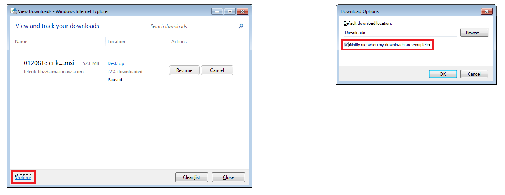  

<h3>Allow Local Files to Run Unhindered</h3>

1. Click <strong>Tools > Internet Options</strong>.  
2. Click the <strong>Advanced</strong> tab.  
3. Check <strong>Allow active content to run in files on My Computer</strong> under the <strong>Security</strong> heading.  

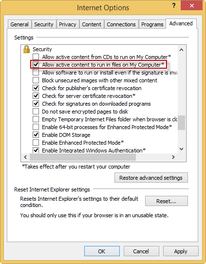  

<h3>Turn Off AutoComplete</h3>

1. Click <strong>Tools > Internet Options</strong>.  
2. Click the <strong>Content</strong> tab.  
3. Click the <strong>Settings</strong> button under the <strong>AutoComplete</strong> section.  
4. In <strong>AutoComplete Settings</strong>, uncheck <strong>Forms</strong> and <strong>User names and passwords on forms</strong>.  

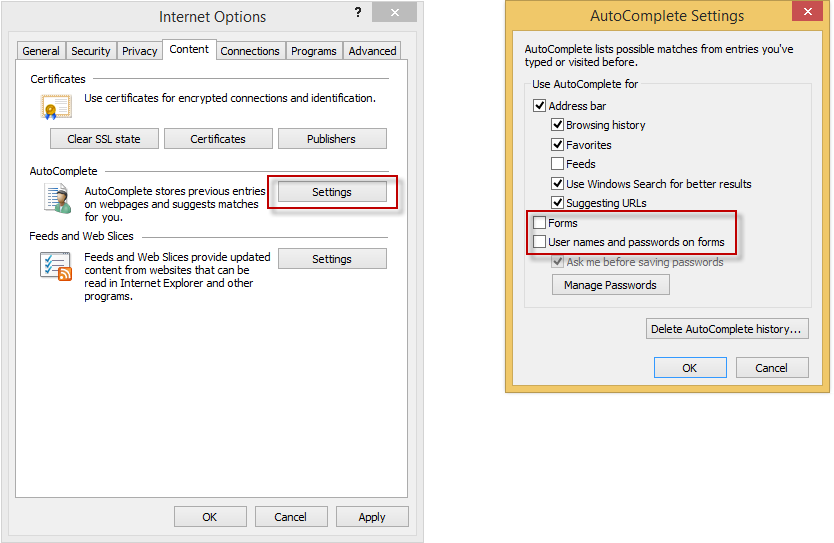  

<h3>Windows updates</h3>

The latest Internet Explorer updates should be installed.   

<strong>Note:</strong> Installing <a href="http://www.microsoft.com/en-us/download/details.aspx?id=44431" target="_blank">KB2987107</a> security update for Internet Explorer 11 helps some customers with recording issues.  

<h3>Add http://www.w3.org to Trusted Sites</h3>

1. Click <strong>Tools > Internet Options</strong>.  
2. Click the <strong>Security</strong> tab.  
3. Click <strong>Trusted sites</strong>.  
4. Add <strong>http://www.w3.org</strong> to the trusted sites.  

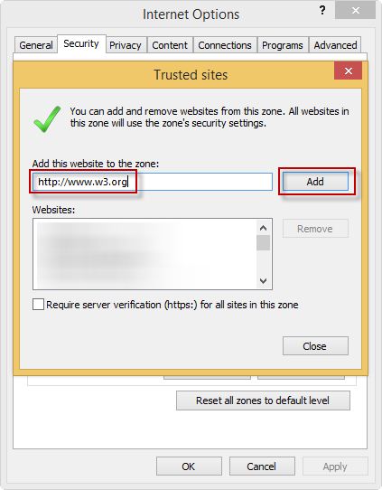  

### Chrome

If you need to double check manually if all settings are correct expand the <a href="#Manual_Configuration">Manual Configuration</a> section below.  

> 
If your Chrome browser has an active <strong>Google Apps session</strong> (for example, you are logged into GMail), automatic calibration will not work as expected. To use automatic configuration, log out of your Google account first.

<a name="Manual_Configuration" style="color:black; text-decoration: none;";> Manual Configuration  + </a>

 

<h3>Enable Extensions</h3>

1.&nbsp; Click on  located in the upper right corner of the browser <strong>More tools > Extensions</strong>.  

2.&nbsp; Ensure that the <strong>Progress Test Studio Extension</strong> is enabled.  

  

<h3>Zoom Level Set to 100%</h3>

1.&nbsp; Click on  in the upper right corner.  

2.&nbsp; Use the plus (+) and minus (-) buttons next to <strong>Zoom</strong> to set it to 100% (or use the keyboard shortcut: Ctrl + 0).   

  

<h3>Enable File Downloads</h3>

1.&nbsp; Click on  in the upper right corner.  

2.&nbsp; Select <strong>Settings</strong> from the drop-down menu.  

3.&nbsp; Scroll to the bottom and click <strong>Advanced</strong>.  

4.&nbsp; Locate the <strong>Downloads</strong> section.  

5.&nbsp; Enable <strong>Ask where to save each file before downloading</strong>.  

  

<h3>Disable Pop-up Blocker</h3>

1.&nbsp; Click on  in the upper right corner.  

2.&nbsp; Select <strong>Settings</strong> from the drop-down menu.  

3.&nbsp; Scroll to the bottom and click <strong>Advanced</strong>.  

4.&nbsp; Locate the <strong>Privacy and security</strong> section.  

5.&nbsp; Click <strong>Content Settings</strong>.  

  

6.&nbsp; Under <strong>Popups</strong> section enable <strong>Allowed</strong>.  

  

<h3>Allow All Sites to Run JavaScript</h3>

1.&nbsp; Click on  in the upper right corner.  

2.&nbsp; Select <strong>Settings</strong> from the drop-down menu.   

3.&nbsp; Scroll to the bottom and click <strong>Advanced</strong>.   

4.&nbsp; Locate the <strong>Privacy and security</strong> section.    

5.&nbsp; Click <strong>Content Settings</strong>.  

6.&nbsp; Under <strong>JavaScript</strong> enable <strong>Allowed</strong>.  

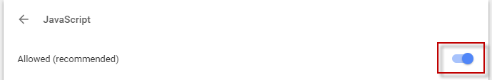  

<h3>Unblock Third-Party Cookies and Site Data</h3>

1.&nbsp; Click on  in the upper right corner <strong>Settings > Advanced > Privacy and security > Content Settings > Cookies </strong>.  

2.&nbsp; Enable <strong>Allow sites to save and read cookie data (recommended)</strong>.  

3.&nbsp; Disable <strong>Block third-party cookies</strong>.  

  

<h3>Allow all Sites to Download Multiple Files Automatically</h3>

1.&nbsp; Click on  in the upper right corner <strong>> Settings > Advanced > Privacy and security > Content Settings</strong>.   

2.&nbsp; Under <strong>Automatic Downloads</strong> section enable <strong>Allow all sites to download multiple files automatically</strong> .  

  

<h3>Disable Web Security</h3>

1. Open the Default Chrome User data folder under the your Windows account - "C:\Users\[WindowsUser]\AppData\Local\Google\Chrome\User Data\Default" and locate the <strong>Preferences</strong> file.
 

2. Open it with a text editor and search for "webkit". If there is no such preference in the file, add the following at the bottom of the file:
 

    
"webkit":{"webprefs":{"web_security_enabled":false}}

 

If the "webkit" preference already exists in the <strong>Preferences</strong> file and has any value in the "webprefs", you can add the web security as follows:

 

    
Existing values listed in the file:

    
"webkit":{"webprefs":{"minimum_font_size":6}}
 
    
The file after adding the web security:

    
"webkit":{"webprefs":{"minimum_font_size":6, "web_security_enabled":false}}

### FireFox

If you need to double check manually if all settings are correct expand the <a href="#Manual_Configuration">Manual Configuration</a> section below.  

<a name="Manual_Configuration" style="color:black; text-decoration: none;";> Manual Configuration  + </a>

<h3>Enable Progress Test Studio Extension</h3>

1. Click on browser settings in the right upper corner and press on <strong>Add-ons</strong>.  

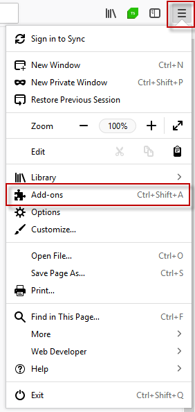  

2. Ensure that the <strong>Progress Test Studio Extension</strong> is enabled.  

  

<h3>Zoom Level Set to 100%</h3>

1. Click on browser settings. 

2. Use the plus (+) and minus (-) buttons to set it to 100%.  

  

<h3>Turn Off Pop-up Blocker & Enable JavaScript</h3>

1. Click on browser settings and press on <strong>Options</strong>.  

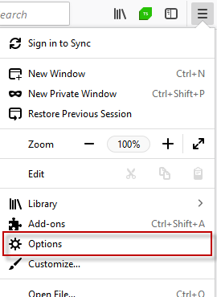  

2. Click on the <strong>Privacy and Security</strong> tab (on the left side) and scroll down to <strong>Permissions</strong> section.  

3. Uncheck the <strong>Block pop-up windows</strong> checkbox.  

  

<h3>Pop-ups Open in a New Tab</h3>

1. Click on browser settings and press on <strong>Options</strong>. 

2. Scroll down to <strong>Tabs</strong> section and check <strong>Open new windows in a new tab instead</strong>.   

  

<h3>Enable File Downloads</h3>

1. Click on browser settings and press on <strong>Options</strong>. 

2. Scroll down to <strong>Downloads</strong> section and check and select <strong>Always ask you where to save files</strong>.  

  

<h3>Enable Cookies</h3>

1. Click on browser settings and press on <strong>Options</strong>. 
2. Click on the <strong>Privacy and Security</strong>. 
3. Scroll down to <strong>History</strong> section to set the option to <strong>Remember history</strong>.  

  

<h3>Disable 'Remember passwords for sites'</h3>

1. Click on browser settings and press on <strong>Options</strong>. 
2. Click on the <strong>Privacy and Security</strong>. 
3. Make sure the <strong>Remember logins and passwords for websites</strong> option is disabled.  

  

<h3>Use System Proxy Settings</h3>

As of the 2012 R1 version released in April 2012, set the Connection Settings to Use system proxy settings.  

1. Click on browser settings and press on <strong>Options</strong>. 
2. Click on the <strong>General</strong>. 
3. Scroll down to <strong>Network Proxy</strong> section and press on <strong>Settings... </strong> button. 
4. In the <strong>Connection Settings</strong> window select <strong>Use system proxy settings</strong>.  

  

<h3>Setting Configuration Flags</h3>

There are three more settings to be modified in the configuration editor -  type <strong>about:config</strong> in the url bar and press Enter to access it. Double click the following settings to set these to <strong>false</strong>:

<ul>
	<li> <strong>browser.sessionstore.resume_from_crash</strong>     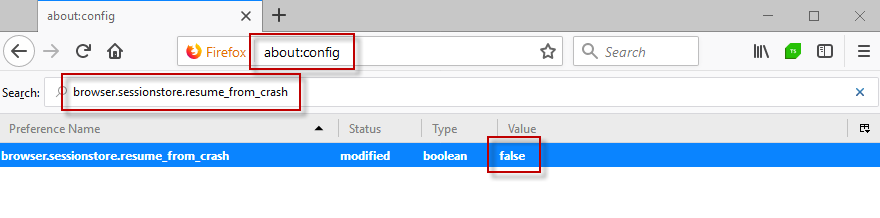   </li>
	<li> <strong>browser.tabs.warnOnClose</strong>      </li>
	<li> <strong>browser.tabs.warnOnCloseOtherTabs</strong>       </li>

</ul>

 

<h3>Disable Conflicting Extensions</h3>

The following Add-ons are known to conflict with the Progress Test Studio Extension:  

<ul>
	<li>AOL Messaging Toolbar</li>
	<li>FoxyProxyStandard</li>
</ul>

### Microsoft Edge

If you need to double check manually if all settings are correct expand the <a href="#Manual_Configuration">Manual Configuration</a> section below.

<a name="Manual_Configuration" style="color:black; text-decoration: none;";>Manual Configuration +</a>

<h3>Zoom Level Set to 100%</h3>

1.&nbsp; Go to the higher right of the browser and click on the <strong>3 dots button</strong>.  

2.&nbsp; Select 100% zoom (or use the keyboard shortcut: Ctrl + 0).  

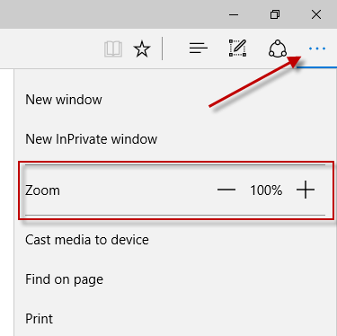  

<h3>Hide The Favorites Bar</h3>

This bar conflicts with highlighting coordinates.  

1.&nbsp; Go to the higher right of the browser and click on the <strong>3 dots button</strong>.  

2.&nbsp; Click <strong>Settings</strong> and then <strong>View favorite settings</strong>.  

3.&nbsp; Set <strong>Show the favorites bar</strong> to <strong>Off</strong>.  

<h3>Open New Tabs With A Blank Page</h3>

1.&nbsp; Go to the higher right of the browser and click on the <strong>3 dots button</strong>.  

2.&nbsp; Click <strong>Settings</strong>.  

3.&nbsp; Set <strong>Open new tabs with</strong> to <strong>A blank page</strong>.  

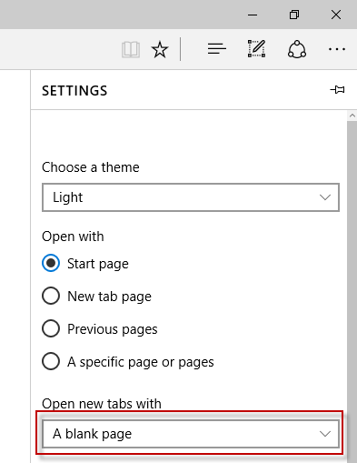

<h3>Disable Password Save Offering</h3>

1.&nbsp; Go to the higher right of the browser and click on the <strong>3 dots button</strong>.  

2.&nbsp; Click <strong>Settings</strong> and then <strong>View advanced settings</strong>.  

3.&nbsp; Set <strong>Offer to save passwords</strong> and <strong>Save for entries</strong> to <strong>Off</strong>.  

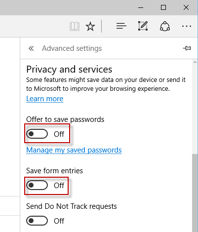

<h3>Allow Cookies</h3>

1.&nbsp; Go to the higher right of the browser and click on the <strong>3 dots button</strong>.  

2.&nbsp; Click <strong>Settings</strong> and then <strong>View advance settings</strong>.  

3.&nbsp; Set <strong>Cookies</strong> to <strong>Don't block cookies</strong>.  

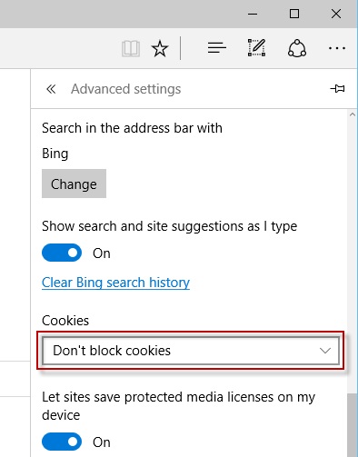

### Safari

If you need to double check manually if all settings are correct expand the <a href="#Manual_Configuration">Manual Configuration</a> section below.

<a href="#" style="color:black; text-decoration: none;";>Manual Configuration +</a>

<h3>Zoom Level Set to 100%</h3>

1. Click the <strong>Page</strong> icon and then select <strong>Zoom</strong>.  
2. Choose <strong>Actual Size</strong> (or use the keyboard shortcut: Ctrl + 0).  

  

<h3>Enable File Downloads</h3>

1. Click the <strong>Tools</strong> icon and then select <strong>Preferences</strong> from the drop-down menu.  
2. Click on the <strong>General</strong> tab.  
3. Make sure that <strong>Always prompt before downloading</strong> is checked.  

  

<h3>Disable Pop-up Blocker, Enable Plug-ins, Accept Cookies, Enabled JavaScript, & No Mixed Content Prompt</h3>

1. Click the <strong>Tools</strong> icon and then select <strong>Preferences</strong> from the drop-down menu.  
2. Click on the <strong>Security</strong> tab.  
3. Make sure that <strong>Enable JavaScript</strong> is checked.  
4. Make sure that <strong>Block pop-up windows</strong> is unchecked.  
5. Make sure <strong>Always</strong> is selected.  
6. Make sure <strong>Ask before sending a non-secure form to a secure website</strong> is unchecked.  

  

<h3>Enable Extensions</h3>

1. Click the <strong>Tools</strong> icon and then select <strong>Preferences</strong> from the drop-down menu.  
2. Click on the <strong>Extensions</strong> tab.  
3. Make sure that Extensions is set to <strong>On</strong>.  
4. Make sure that the <strong>Telerik Test Studio Automation Extension</strong> extension is enabled.  

  

<h3>Pop-ups Open in a New Window</h3>

1. Click the <strong>Tools</strong> icon and then select <strong>Preferences</strong> from the drop-down menu.  
2. Click on the <strong>Tabs</strong> tab.  
3. Set <strong>Open pages in tabs instead of windows</strong> to <strong>Never</strong>.  
4. Place a check by <strong>When a new tab or window opens, make it active</strong>.  

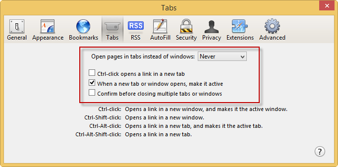  

<h3>Never Block Cookies</h3>

1. Click the <strong>Tools</strong> icon and then select <strong>Preferences</strong> from the drop-down menu.  
2. Click on the <strong>Privacy</strong> tab.  
3. Under the <strong>Block cookies</strong> section, select <strong>Never</strong>.  

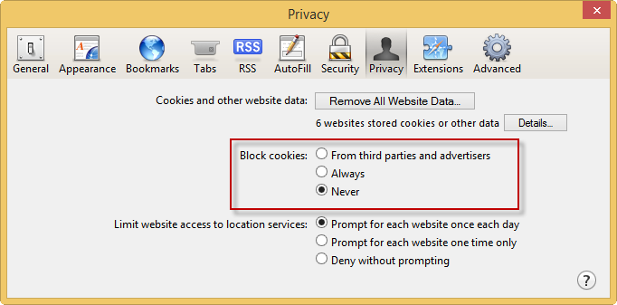  

