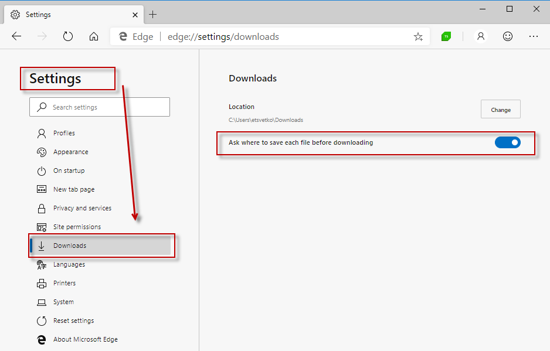
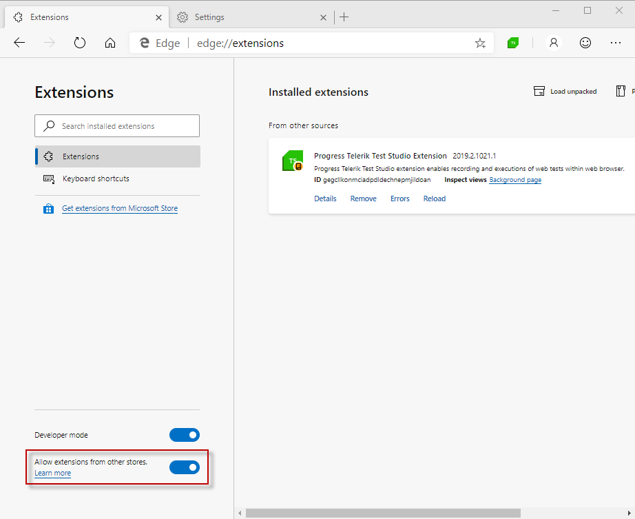

# Calibrate Browsers

A specific set of settings is required to enable each of the supported browsers for test recording and execution with Test Studio Dev and this is called __Browser Calibration__. Some of the browsers also require the installation of an extension.





## Built-in Calibration

We call that the browser is __calibrated__ when the required settings are applied. __Test Studio Dev__ provides a built-in configuration approach which will set all necessary settings for the supported browsers out of the box and no manual interaction is required. To use our built-in feature open the __Test Studio Dev Settings__ window and switch to its __Browser__ tab.


In the __Browser__ tab are listed the installed browsers on the current machine with a _Calibrate/Restore_ button next to each. If a browser is successfully calibrated the button allows you to restore its previous settings.


If a browser is not yet configured the button allows you to calibrate it.


> __Note!__
> 
> 
> During browser calibration __Test Studio Dev automatically closes__ all currently running browser instances. Ensure there is no important information you might lose if browser gets closed before proceeding with calibration</br></br>

> __Tip__
> 
> 
> You can check all settings applied from the calibration in the <a href="#manual-settings-to-configure-a-browser">Manual Configuration</a> section below (click the + sign to expand it).

## Enable Chrome and Edge Chromium for Automation 

Once Chrome and Edge Chromium browsers are __calibrated you can continue with recording and executing__ the automated tests. 

## Enable Firefox for Automation

Firefox browser requires an extension for the purposes of automation testing with __Test Studio Dev__.

The __Firefox__ extension can be found in the Firefox Add-ons Page - <a href="https://addons.mozilla.org/en-US/firefox/addon/progress-test-studio-extension/", target=blank>__Progress Test Studio Extension__</a>.

## Settings Applied from the Calibration

### Chrome

> <p>If your Chrome browser has an active <strong>Google Apps session</strong> (for example, you are logged into GMail), automatic calibration will not work as expected. To use automatic configuration, log out of your Google account first.</p><p></p>
<p></p>

You can check all settings applied from the calibration in the <a href="#Manual_Configuration">Manual Configuration</a> section below (click the + sign to expand it).

### Manual Configuration

#### Enable Extensions

1.&nbsp; Click on  located in the upper right corner of the browser <strong>More tools > Extensions</strong>.

2.&nbsp; Ensure that the <strong>Progress Test Studio Extension</strong> is enabled.


#### Zoom Level Set to 100%

1.&nbsp; Click on  in the upper right corner.

2.&nbsp; Use the plus (+) and minus (-) buttons next to <strong>Zoom</strong> to set it to 100% (or use the keyboard shortcut: Ctrl + 0). 


#### Enable File Downloads

1.&nbsp; Click on  in the upper right corner.

2.&nbsp; Select <strong>Settings</strong> from the drop-down menu.

3.&nbsp; Scroll to the bottom and click <strong>Advanced</strong>.

4.&nbsp; Locate the <strong>Downloads</strong> section.

5.&nbsp; Enable <strong>Ask where to save each file before downloading</strong>.


#### Disable Pop-up Blocker

1.&nbsp; Click on  in the upper right corner.

2.&nbsp; Select <strong>Settings</strong> from the drop-down menu.

3.&nbsp; Scroll to the bottom and click <strong>Advanced</strong>.

4.&nbsp; Locate the <strong>Privacy and security</strong> section.

5.&nbsp; Click <strong>Content Settings</strong>.


6.&nbsp; Under <strong>Popups</strong> section enable <strong>Allowed</strong>.


#### Allow All Sites to Run JavaScript

1.&nbsp; Click on  in the upper right corner.

2.&nbsp; Select <strong>Settings</strong> from the drop-down menu. 

3.&nbsp; Scroll to the bottom and click <strong>Advanced</strong>. 

4.&nbsp; Locate the <strong>Privacy and security</strong> section.  

5.&nbsp; Click <strong>Content Settings</strong>.

6.&nbsp; Under <strong>JavaScript</strong> enable <strong>Allowed</strong>.


#### Unblock Third-Party Cookies and Site Data

1.&nbsp; Click on  in the upper right corner <strong>Settings > Advanced > Privacy and security > Content Settings > Cookies </strong>.

2.&nbsp; Enable <strong>Allow sites to save and read cookie data (recommended)</strong>.

3.&nbsp; Disable <strong>Block third-party cookies</strong>.


#### Allow all Sites to Download Multiple Files Automatically

1.&nbsp; Click on  in the upper right corner <strong>> Settings > Advanced > Privacy and security > Content Settings</strong>. 

2.&nbsp; Under <strong>Automatic Downloads</strong> section enable <strong>Allow all sites to download multiple files automatically</strong> .


#### Disable Web Security

1. Open the Default Chrome User data folder under the your Windows account - "C:\Users\[WindowsUser]\AppData\Local\Google\Chrome\User Data\Default" and locate the <strong>Preferences</strong> file.

2. Open it with a text editor and search for "webkit". If there is no such preference in the file, add the following at the bottom of the file:

````
~"webkit":{"webprefs":{"web_security_enabled":false}}
````

If the "webkit" preference already exists in the <strong>Preferences</strong> file and has any value in the "webprefs", you can add the web security as follows:

````
Existing values listed in the file:
"webkit":{"webprefs":{"minimum_font_size":6}}
The file after adding the web security:
"webkit":{"webprefs":{"minimum_font_size":6, "web_security_enabled":false}}
````

### Edge Chromium

You can check all settings applied from the calibration in the <a href="#Manual_Configuration">Manual Configuration</a> section below (click the + sign to expand it).

### Manual Configuration

#### Enable Extensions

1.&nbsp; Click on Edge browser *Settings* button - the three dots located in the upper right corner of the browser <strong>Settings -> Extensions</strong>.

2.&nbsp; Ensure that the <strong>Progress Telerik Test Studio Extension</strong> is enabled.


#### Zoom Level Set to 100%

1.&nbsp; Click on Edge browser *Settings* button - the three dots located in the upper right corner of the browser.

2.&nbsp; Use the plus (+) and minus (-) buttons next to <strong>Zoom</strong> to set it to 100%. 


#### Enable File Downloads

1.&nbsp; Click on Edge browser *Settings* button - the three dots located in the upper right corner of the browser.

2.&nbsp; Select <strong>Settings</strong> from the drop-down menu.

3.&nbsp; Locate the <strong>Downloads</strong> section.

4.&nbsp; Enable <strong>Ask where to save each file before downloading</strong>.



#### Disable Pop-up Blocker

1.&nbsp; Click on Edge browser *Settings* button - the three dots located in the upper right corner of the browser.

2.&nbsp; Select <strong>Settings</strong> from the drop-down menu.

3.&nbsp; Locate the <strong>Site Permissions</strong> section.

4.&nbsp; Open the <strong>Pop-ups and redirects</strong> section.

5.&nbsp; Disable the <strong>Block</strong> option.


#### Allow All Sites to Run JavaScript

1.&nbsp; Click on Edge browser *Settings* button - the three dots located in the upper right corner of the browser.

2.&nbsp; Select <strong>Settings</strong> from the drop-down menu.

3.&nbsp; Locate the <strong>Site Permissions</strong> section.

4.&nbsp; Open the <strong>JavaScript</strong> section.

5.&nbsp; Enable the <strong>Allowed</strong> option.


#### Unblock Third-Party Cookies and Site Data

1.&nbsp; Click on Edge browser *Settings* button - the three dots located in the upper right corner of the browser.

2.&nbsp; Select <strong>Settings</strong> from the drop-down menu.

3.&nbsp; Locate the <strong>Site Permissions</strong> section.

4.&nbsp; Open the <strong>Cookies and site data</strong> section.

5.&nbsp; Enable the <strong>Allow sites to save cookies</strong> option.

6.&nbsp; Disable the <strong>Block third-party cookies</strong> option.


#### Allow all Sites to Download Multiple Files Automatically

1.&nbsp; Click on Edge browser *Settings* button - the three dots located in the upper right corner of the browser.

2.&nbsp; Select <strong>Settings</strong> from the drop-down menu.

3.&nbsp; Locate the <strong>Site Permissions</strong> section.

4.&nbsp; Open the <strong>Automatic downloads</strong> section.

5.&nbsp; Enable the <strong>Ask when site tries to download multiple files</strong> option.


#### Allow Extension from Other Stores

1.&nbsp; Click on Edge browser *Settings* button - the three dots located in the upper right corner of the browser.

2.&nbsp; Select <strong>Extensions</strong> from the drop-down menu.

3.&nbsp; Locate the <strong>Site Permissions</strong> section.

4.&nbsp; Enable the <strong>Allow extensions from other stores</strong> option.



### FireFox

You can check all settings applied from the calibration in the <a href="#Manual_Configuration">Manual Configuration</a> section below (click the + sign to expand it).

#### Manual Configuration 

#### Enable Progress Test Studio Extension

1. Click on browser settings in the right upper corner and press on <strong>Add-ons</strong>.


2. Ensure that the <strong>Progress Test Studio Extension</strong> is enabled.


#### Zoom Level Set to 100%

1. Click on browser settings.

2. Use the plus (+) and minus (-) buttons to set it to 100%.


#### Turn Off Pop-up Blocker & Enable JavaScript

1. Click on browser settings and press on <strong>Options</strong>.


2. Click on the <strong>Privacy and Security</strong> tab (on the left side) and scroll down to <strong>Permissions</strong> section.

3. Uncheck the <strong>Block pop-up windows</strong> checkbox.


#### Pop-ups Open in a New Tab

1. Click on browser settings and press on <strong>Options</strong>.

2. Scroll down to <strong>Tabs</strong> section and check <strong>Open new windows in a new tab instead</strong>. 


#### Enable File Downloads

1. Click on browser settings and press on <strong>Options</strong>.

2. Scroll down to <strong>Downloads</strong> section and check and select <strong>Always ask you where to save files</strong>.


#### Enable Cookies

1. Click on browser settings and press on <strong>Options</strong>.
2. Click on the <strong>Privacy and Security</strong>.
3. Scroll down to <strong>History</strong> section to set the option to <strong>Remember history</strong>.


#### Disable 'Remember passwords for sites'

1. Click on browser settings and press on <strong>Options</strong>.
2. Click on the <strong>Privacy and Security</strong>.
3. Make sure the <strong>Remember logins and passwords for websites</strong> option is disabled.


#### Use System Proxy Settings

As of the 2012 R1 version released in April 2012, set the Connection Settings to Use system proxy settings.

1. Click on browser settings and press on <strong>Options</strong>.
2. Click on the <strong>General</strong>.
3. Scroll down to <strong>Network Proxy</strong> section and press on <strong>Settings... </strong> button.
4. In the <strong>Connection Settings</strong> window select <strong>Use system proxy settings</strong>.


#### Setting Configuration Flags

There are three more settings to be modified in the configuration editor -  type <strong>about:config</strong> in the url bar and press Enter to access it. Double click the following settings to set these to <strong>false</strong>:

- <strong>browser.sessionstore.resume_from_crash</strong>   
- <strong>browser.tabs.warnOnClose</strong>  
- <strong>browser.tabs.warnOnCloseOtherTabs</strong>   

#### Disable Conflicting Extensions

The following Add-ons are known to conflict with the Progress Test Studio Extension: 

- AOL Messaging Toolbar
- FoxyProxyStandard