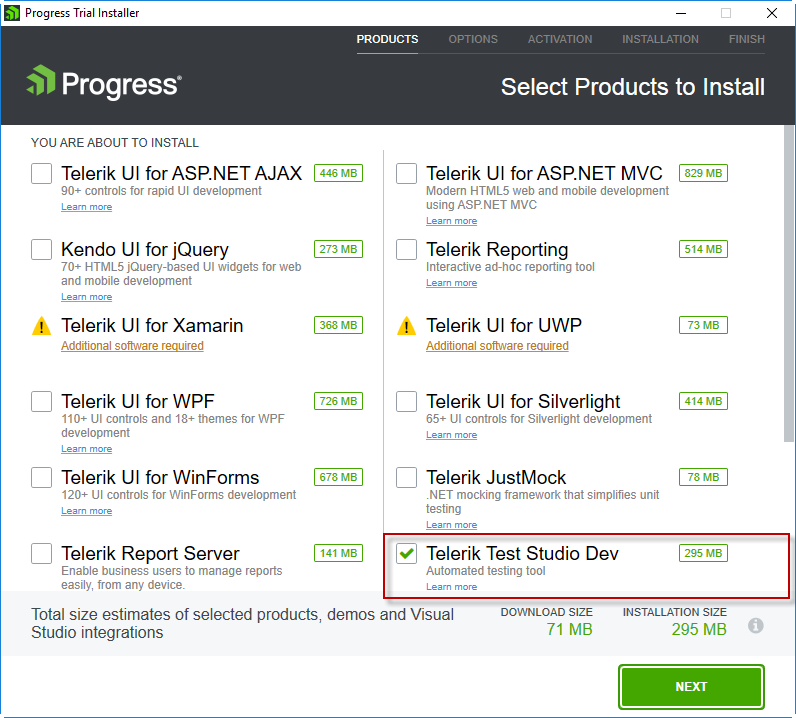
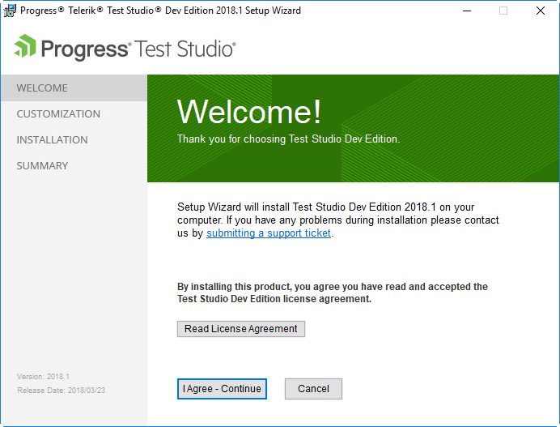
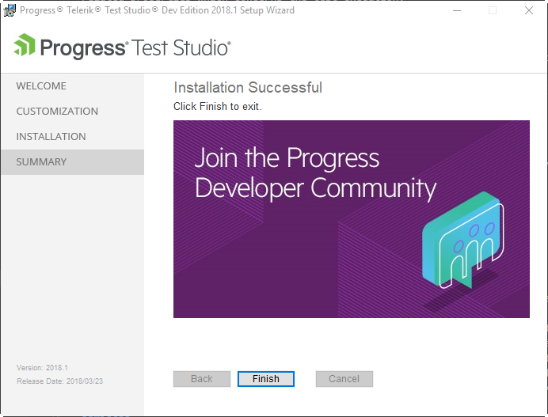

# Install Test Studio Dev

1.Download the installer from the Your Account in the Telerik page:

- If this is your first time here and you want to try __Test Studio Dev__, download the trial installer of DevCraft Ultimate bundle  from <a href="https://www.telerik.com/teststudio-dev" target="_blank">here</a>. By default all products in the bundle are ready to be installed. If you would like to try out Test Studio Dev only you have to uncheck the rest of the products. 

- If you are a licensed Test Studio Dev user, log in your Telerik account and navigate to the <a href="https://www.telerik.com/account/product-download?product=TSDEVED" target="_blank">Test Studio Dev download page</a>.

2.Run the installer and follow the steps. Configure the default installation folder.

3.When the installation is complete, the Installation Successful screen is displayed.

__See Also:__

<a href="/prerequisites/activate-license" target="_blank">How to activate my Test Studio Dev license?</a>