# Getting Started: Automation Testing with Test Studio Dev

One article with step-by-step quick start guide – what are the first and most important steps in order to have your first viable test from functional point of view (no installation and licensing). The steps will give summarized information about each step. For detailed information there will be links for the respective article from the Features section.

## Create a Test Studio Dev Project

Create a new project using the Test Studio Dev template - select _Create New Test Project_ under the _Telerik->Test Studio_ menu.

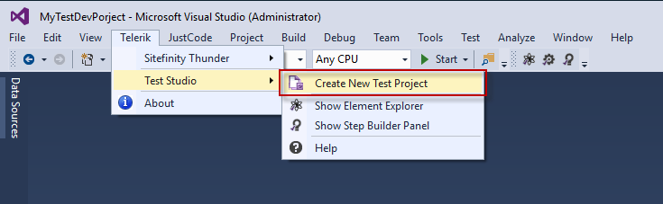

Next choose the type of programming language between _C# or VB.NET_ and set a meaningful name for your first project.

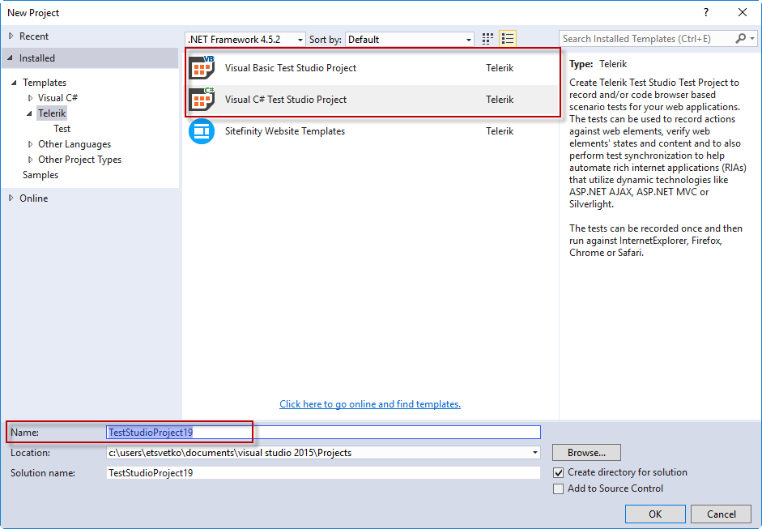

### Add a Test in Project

By default the newly created project contains a Web test.

To add new test in the project click with the right mouse button on the project name in Solution Explorer, select _Add_ and choose between _Test Studio Web Test..._ or _Test Studio WPF Test..._.

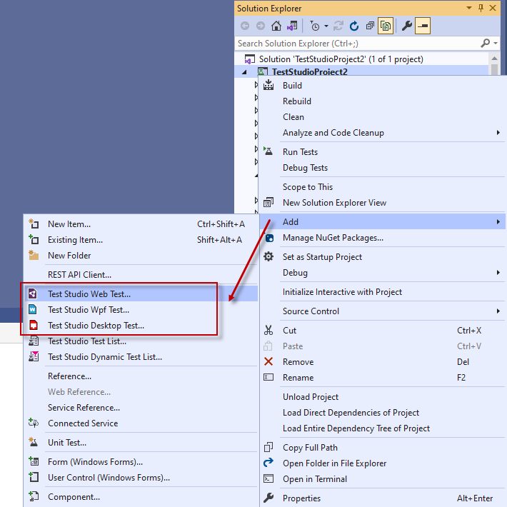

The respective item is selected in the list of items, type a name and click _Add_.

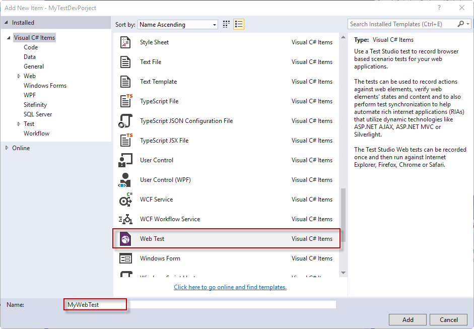

To open the test double click on its name in the Solution Explorer. 

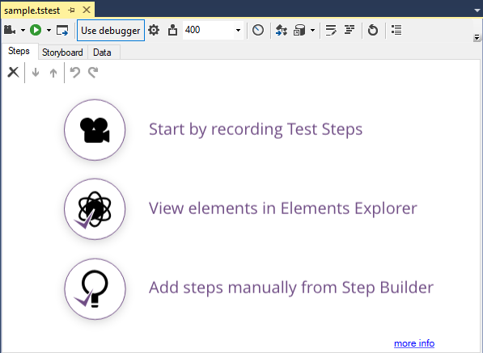

## Record a Test

>__Note!__ The supported for __recording browsers__ are __Internet Explorer__, __Chrome__ and __FireFox__

Double click a test from the Solution Explorer to open it. Click on the _Record_ button to launch a new browser or an instance of the WPF application to record against.

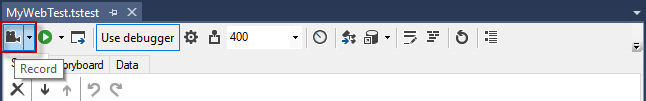

Once the browser/application is launched the <a href="/features/recorder/recording-toolbar" target="_blank">Test Studio Dev recorder toolbar</a> will be attached to the that instance and will record steps in the test for each action against the application under test. 

__See also:__

* <a href="/features/recorder/record-test#Record-a-Web-Test" target="_blank">How to record a web test step by step</a>
* <a href="/features/recorder/record-test#Record-a-WPF-Test" target="_blank">How to record a WPF test step by step</a>

## Elements Explorer

The <a href="/features/elements-explorer/overview" target="_blank">Elements Explorer</a> displays all elements included in the test during recording the test. It is similar to the DOM Explorer in that it displays a tree of elements, but the Elements Explorer only contains elements you want to use in your tests. Also, the elements in the tree view have properties that are more specific to testing.

To open the Elements Explorer in project click on the _Show Elements Explorer_ button. It will appear in the lower middle pane next to _Error List_ and _Output_ tabs.

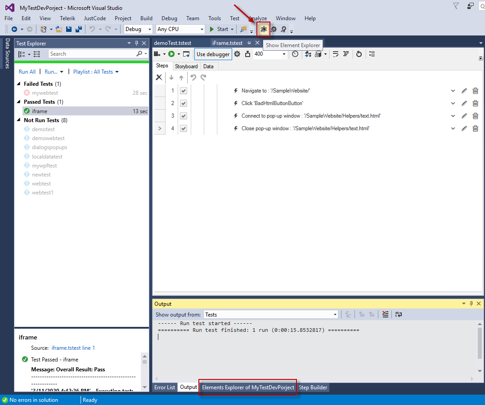

The Elements Explorer can be also shown on screen from the Telerik menu. 

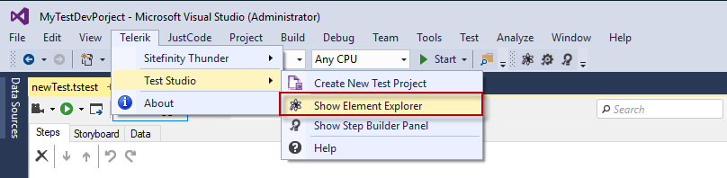

## Execute a Test

>__Note!__ The supported browsers for execution are __Internet Explorer, Chrome, FireFox, Microsoft Edge, Safari__.

Test Studio Dev tests could be executed from the _VS Test Explorer_ or with the _Test Studio Dev Test Runner_.

### Test Studio Dev Quick Execution

To execute the currently opened test click on the _Execute Test_ button to select a browser to run the test against.

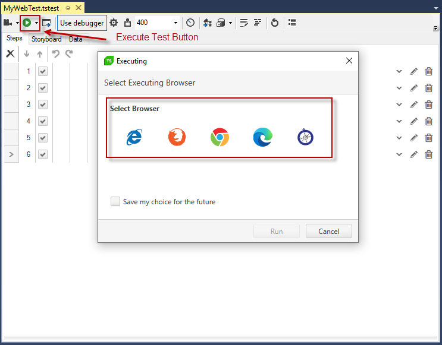

An instance of the selected browser will start and all recorded actions in test will be executed.

Read more details for the <a href="/features/test-execution/quick-execution" target="_blank">settings</a> which could be applied for the test run.

### VS Test Explorer Execution

The Test Explorer in Visual Studio automatically lists and provides all __Test Studio Dev__ tests for execution. 

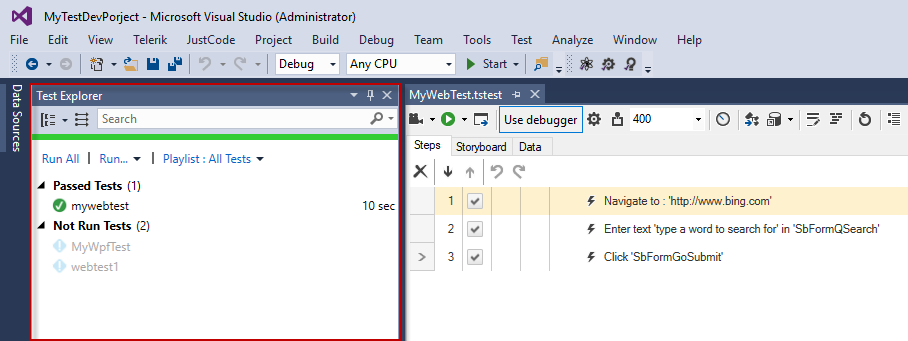

Ensure the __project is re-built before initiating a run from the VS Test Explorer__. Any recent changes will not be reflected otherwise.

Run the tests with the _Run All_ button. Or choose a group of tests to run from the dropdown options of the _Run..._ button in Test Explorer.

An instance of the selected browser will start and all recorded actions in test will be executed.

Find further details for the <a href="/features/test-execution/vs-test-explorer" target="_blank">Test Explorer execution</a>.

### Executing Tests in CI Environment

Include a short summary and links to the respective articles.

## Test Results

Each test run generates test results. 

### View Results

__Test Studio Dev Quick Execution__ displays the outcome of the executed test in overall and writes verbose results info in an <a href="/features/failed-tests-debugging/using-the-execution-log" target="_blank">_Execution log_</a>. The test results are available for review as long as the test stays opened in the solution or until the _Clear results_ button is clicked.

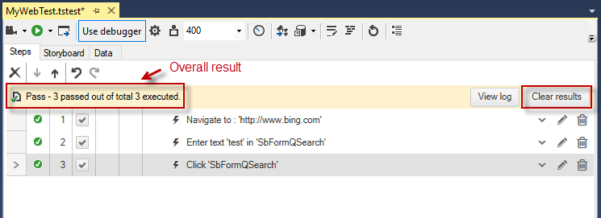

The _Execution log_ provides details for the executed steps in the test.

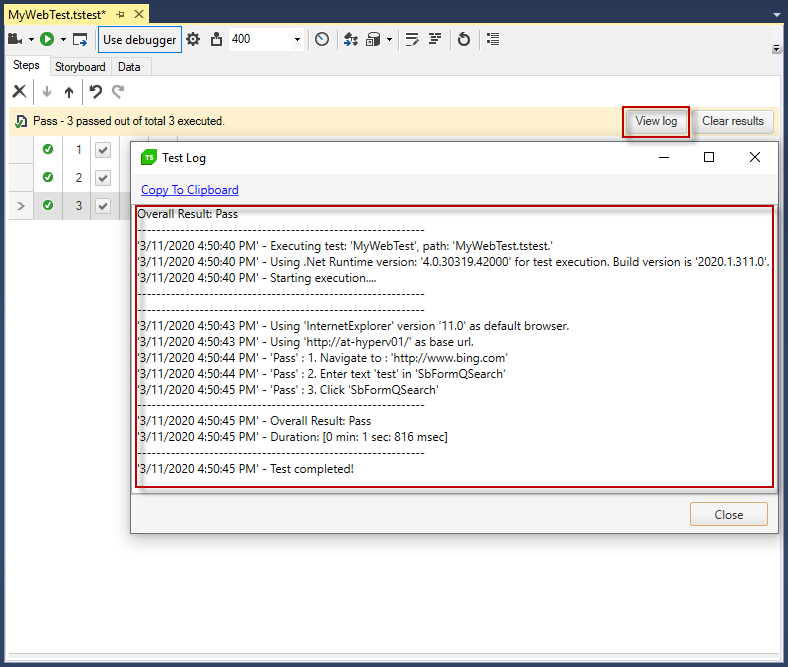

__VS Test Explorer__ displays the results of test execution under the list of test in Test Explorer pane. These are in the same format as the results generated by Test Studio Dev execution. The test results are available until the project/solution stays opened.

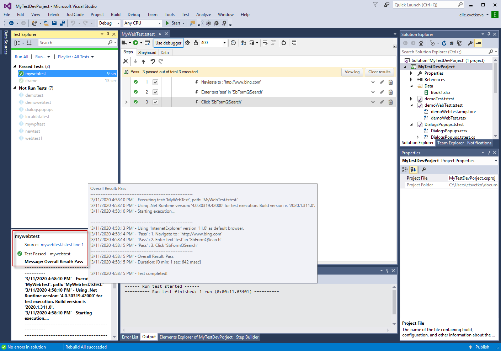

### Debugging Failed Test Results

The test execution will be terminated in case a step fails and the test will be marked as _Failed_.

__Test Studio Dev__ displays status for each step in the test - _Passed, Failed, Not Run_. Hovering over the red crossed circle in front the failed step will show a tooltip with details about the failure.

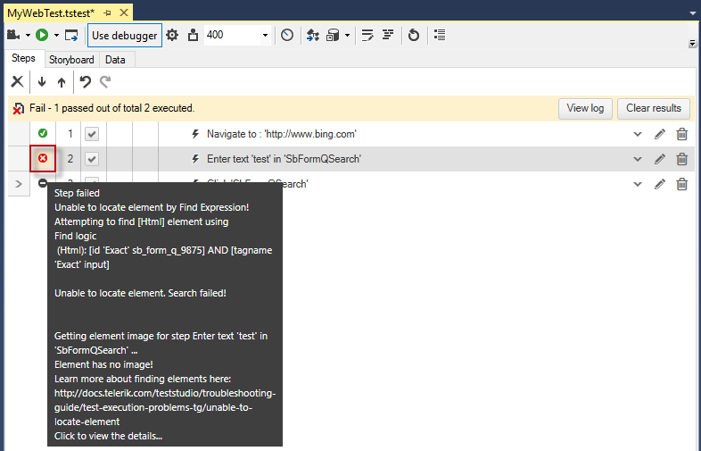

Double click on the red crossed circle opens the <a href="/features/failed-tests-debugging/step-failure-details" target="_blank">__Step Failure Details__</a> dialog. It provides detailed description of the failure reason and additional debugging options.

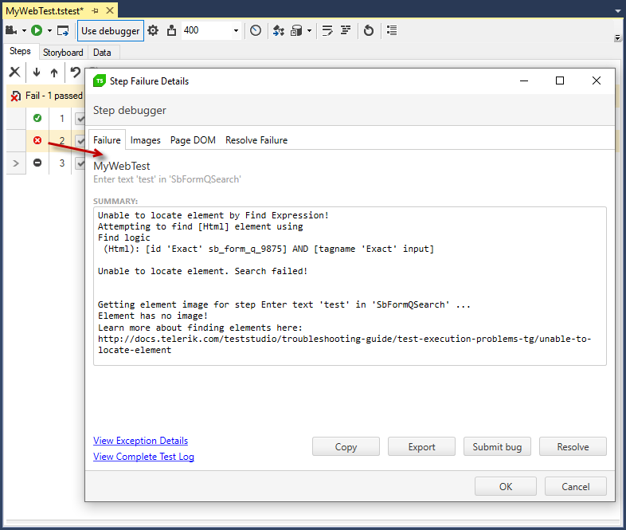

__VS Test Explorer__ displays the test as well as _Failed_. The test result is under the listed tests and displays the common information for the failure as it is listed in the Execution log.

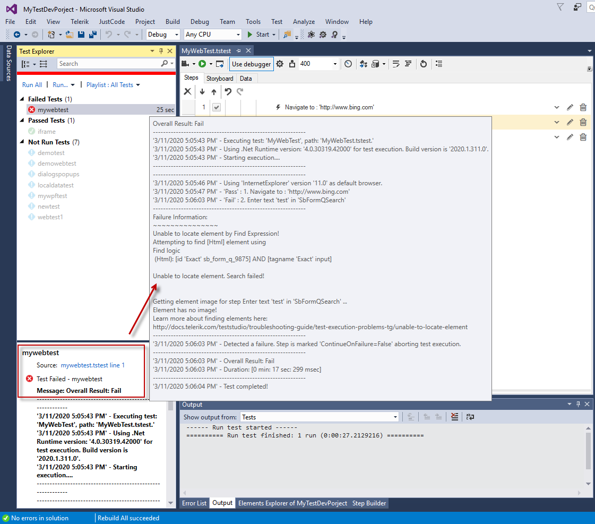

## Coded Steps

__Test Studio Dev Edition__ allows you to implement coded solutions for scenarios that require more complexity than what can be composed with recording your actions or building advanced steps with the Step Builder. You can create new or convert existing steps to coded ones, define your custom logic in code behind files or any custom library that your projects links to. For more detailed information read the following <a href="/code-in-test/features-in-code" target="_blank">article</a>.